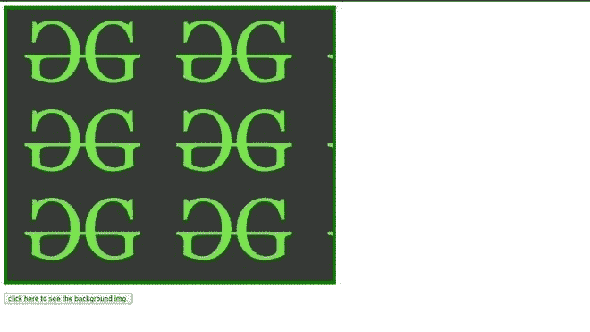

# 如何用 jQuery 获取一个 div 的背景图像？

> 原文:[https://www . geeksforgeeks . org/how-get-a-divs-background-image-with-jquery/](https://www.geeksforgeeks.org/how-to-get-a-divs-background-image-with-jquery/)

任务是用 jQuery 获取 div 的背景图像。您可以使用 jQuery 中的 [CSS()](https://www.geeksforgeeks.org/jquery-css-method/) 方法来实现这个任务。

简单地说，我们需要创建一个空的 div，在点击事件中，空的 div 将获得图像作为背景。

**CSS():** 这是 jQuery 中添加 CSS 属性的内置方法，但是在这种情况下，我们需要使用 [URL()](https://www.geeksforgeeks.org/get-the-current-url-using-jquery/) 方法提供完整的属性。

**语法:**

*   以下语法将返回第一个匹配元素的*背景色*值。

    ```
    css("property_name");
    ```

*   该语法将为所有匹配的元素设置*背景色*值。

    ```
    $("p").css("background-color", "colorName");
    ```

**URL():** 这是一个 CSS 函数，用来包含一个文件。它接受字符串格式的单参数网址。

**语法:**

```
url(" <string> <url-modifier> ")
```

**示例 1:** 首先，用按钮创建一个空的 *div* 。将该按钮映射到 jQuery 中的 *CSS()* 方法。单击按钮后，使用图像放置在 *div* 元素中。

## 超文本标记语言

```
<!DOCTYPE html>
<html lang="en">
  <head>
    <meta charset="utf-8" />
    <style>
      .box {
        width: 600px;
        height: 500px;
        border: 6px solid green;
      }
    </style>
    <script src=
"https://code.jquery.com/jquery-3.5.1.min.js"></script>
    <script>
      $(document).ready(function () {
        $("button").click(function () {
          var imageUrl = "gfg.jpg";
          $(".box").css("background-image", "url(" + imageUrl + ")");
        });
      });
    </script>
  </head>
  <body>
    <div class="box"></div>

    <p><button type="button">
         click here to see the background img.
       </button>
    </p>
  </body>
</html>
```

**输出:**

*   **点击前:**
    
*   **点击后:**
    

**例 2:**

## 超文本标记语言

```
<!DOCTYPE html>
<html lang="en">
  <head>
    <meta charset="utf-8" />
    <style>
      .box {
        width: 600px;
        height: 500px;
        border: 6px solid rgb(61, 65, 61);
      }
    </style>
    <script src=
"https://code.jquery.com/jquery-3.5.1.min.js">
    </script>
    <script>
      $(document).ready(function () {
        $("button").click(function () {
          var imageUrl = "g.jpg";
          $(".box").css("background-image", "url(" + imageUrl + ")");
        });
      });
    </script>
  </head>
  <body>
    <div class="box"></div>

    <p><button type="button">click here !!</button></p>

    <style>
      button {
        background-color: blueviolet;
        align-items: center;
        margin-left: 250px;
      }
    </style>
  </body>
</html>
```

**输出:**

*   **点击前:**
    

*   **After click: **

    