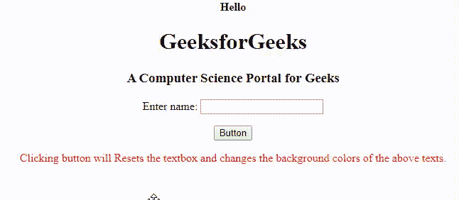

# 如何从 jQuery 选择器中获取 DOM 元素？

> 原文:[https://www . geesforgeks . org/how-to-get-a-DOM-element-from-a-jquery-selector/](https://www.geeksforgeeks.org/how-to-get-a-dom-element-from-a-jquery-selector/)

**文档对象模型(DOM)** 元素类似于 HTML 页面上的 DIV、HTML、BODY 元素。一个 **jQuery 选择器**用于使用 jQuery 选择一个或多个 HTML 元素。我们通常使用 [**选择器**](https://www.geeksforgeeks.org/jquery-selectors-and-event-methods/) 来访问 DOM 元素。如果它们只是 HTML 页面中的一个特定的唯一元素，我们可以通过它的标签 **$(“标签”)**来访问它，但是当我们有多个这样的元素时，我们将使用当**$(“# ID”)**开始起作用时的 ID 来访问它们。

但是如果我们想使用原始的 DOM 元素，那么我们可以将它们转换成 javascript 对象，这样我们就可以将它们用于 javascript 中的方法，而不是 jquery 中的方法。

**语法**

```html
$(“selector”).get(0)

```

或者

```html
$(“selector”)[0]

```

下面的例子说明了这种方法。

**示例 1:** 本示例将使用 **$(“选择器”)。get(0):**

## java 描述语言

```html
<!DOCTYPE html>
<html>

<head>
    <title>The jQuery DOM elements Example</title>

    <script src=
"https://ajax.googleapis.com/ajax/libs/jquery/3.4.1/jquery.min.js">
    </script>

    <script>
        $(document).ready(function() {

            // Access with tag
            $("p").css("color", "red");
            $("button").click(function() {

                // Access with id
                $("#d1").css("color", "purple");
                $("#d2").css("color", "green");
                $("#d3").css("color", "black");

                // Converting into javascript object.
                $("#d4").get(0).reset();
            });
        });
    </script>
</head>

<body style="text-align:center;">

    <div>
        <h4 id="d1">Hello</h4>

        <h1 id="d2">GeeksforGeeks</h1>

        <h3 id="d3">
            A Computer Science Portal for Geeks
        </h3>

        <form id="d4">
            Enter name:
            <input type="text" />
        </form>
        <br>

        <button>Button</button>
        <br>

<p>
            Clicking button will Resets the
            textbox and changes the background
            colors of the above texts.
        </p>

    </div>
</body>

</html>
```

**输出:**由于 reset()方法在 jquery 中不可用，我们已经将 jquery 元素转换为 javascript 对象或原始 DOM 元素。



**示例 2:** 本示例将说明 **$(“选择器”)【0】**选择器的使用。

## java 描述语言

```html
<!DOCTYPE html>
<html>

<head>
    <title>The jQuery Example</title>

    <script src=
"https://ajax.googleapis.com/ajax/libs/jquery/3.4.1/jquery.min.js">
    </script>

    <script>
        $(document).ready(function() {

            // Access with tag
            $("h1").css("color", "green");
            $("button").click(function() {

                // d1 gets replaced with d4.
                $("#d1")[0].outerHTML =
                "<h3 id='d4'>A Computer Science Portal for Geeks</h3>";
                $("#d4").css("color", "black");
            });
        });
    </script>
</head>

<body>
    <center>
        <div>
            <h1 id="d1">Hello Welcome to GeeksforGeeks</h1>

            <button>Button</button>
            <br>

            <h4>
                The above button changes the
                content of the above text.
            </h4>
        </div>
    </center>
</body>

</html>
```

**输出:**


**注意:** As outerHTML 是包含元素本身的元素的 HTML，在 jquery 中不可用。我们已经将 jquery 元素转换为 javascript 对象或原始 DOM 元素，以访问 outerHTML 并将其替换为另一个标题。