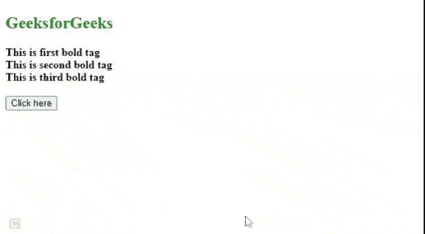

# 如何使用 jQuery 获取粗体标签内的值？

> 原文:[https://www . geeksforgeeks . org/如何使用-jquery/](https://www.geeksforgeeks.org/how-to-get-a-value-within-a-bold-tag-using-jquery/) 获取粗体标记内的值

在本文中，我们将学习使用 jQuery 在粗体标记中获取值。

**方法:**如果我们想在一个加粗的标签内得到值，我们可以使用 jQuery 选择标签。我们可以使用 jQuery**[**text()**](https://www.geeksforgeeks.org/jquery-text-method/)函数来获取加粗标记的值。如果我们想获得所有粗体标签的值，那么我们可以使用 [**(每个)**](https://www.geeksforgeeks.org/jquery-misc-each-method/) 循环，该循环将逐个选择所有粗体标签。**

****步骤:****

*   **创建一些 HTML [加粗](https://www.geeksforgeeks.org/html-b-tag/)标签。**
*   **创建一个 jQuery 函数来获取粗体标签中的值。**
*   **向用户显示该值。**

****示例 1:** 本示例有三个粗体标签。当我们点击按钮时，它将使用 jQuery 方法获得所有粗体标签的值。**

## **超文本标记语言**

```
<!DOCTYPE html>
<html>
  <head>
    <meta charset="utf-8" />
    <script src=
"http://ajax.googleapis.com/ajax/libs/jquery/1/jquery.min.js">
    </script>
  </head>
  <body>
    <h2 style="color: green">GeeksforGeeks</h2>
    <b>This is first bold tag</b> <br />
    <b>This is second bold tag</b><br />
    <b>This is third bold tag</b><br /><br />

    <button>Click here</button><br /><br />
    <div id="output"></div>

    <script>
      $(document).ready(function () {
        $("button").click(function () {
          var count = 0;
          var res = "";
          $("b").each(function () {
            var x =
              "value of index " +
              count +
              ", bold tag is: '" +
              $(this).text() +
              "'<br>";
            res = res + " " + x;
            count++;
          });
          $("#output").html(res);
        });
      });
    </script>
  </body>
</html>
```

****输出:****

****

****示例 2:** 本示例有三个粗体标签，在每个标签中，它都有一个强单词。当我们点击按钮时，jQuery 函数获取每个粗体标签中的值，并在 HTML *div* 中显示附加的文本。**

## **超文本标记语言**

```
<!DOCTYPE html>
<html>
<head>
    <meta charset=utf-8 />
    <script src=
    "http://ajax.googleapis.com/ajax/libs/jquery/1/jquery.min.js">
    </script>

<script>
    $(document).ready(function(){
        $('#btnID').click(function() {
        var text = "";
        $("b").each(function() {
        text += $(this).text();
        text+=" ";
        });
        $("#showResult").text(text);
      });
    });     

</script>
</head>
<body>
    <h2 style="color:green">GeeksforGeeks</h2>
    <b>Welcome </b>
    <b>to </b>
    <b>GeeksforGeeks</b><br/><br/>

    <input type="button" id="btnID" value="Get bold values"/>
    <br/><br/>
    <div id="showResult"> </div>   

</body>
</html>
```

****输出:****

****