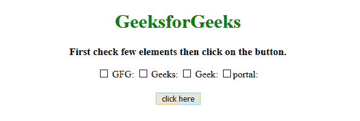
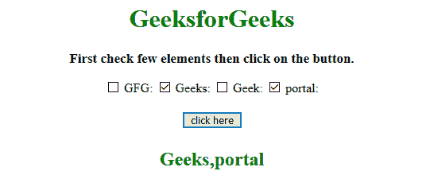
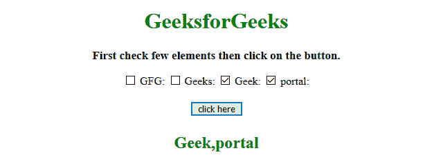

# 如何使用 jQuery 获取数组中所有选中的复选框？

> 原文:[https://www . geeksforgeeks . org/如何使用-jquery/](https://www.geeksforgeeks.org/how-to-get-all-selected-checkboxes-in-an-array-using-jquery/) 获取阵列中所有选中的复选框

给定一些复选框。任务是使用 JQuery 获取数组中所有选中复选框的值。下面讨论的方法很少:

*   [**jQuery on() Method**](https://www.geeksforgeeks.org/jquery-on-with-examples/)
    This method adds one or more event handlers for the selected elements and child elements.
    **Syntax:**

    ```html
    $(selector).on(event, childSel, data, fun, map)

    ```

    **参数:**

    *   **事件:**此参数为必填项。它指定一个或多个要添加到选定元素的事件或命名空间。
        如果有多个事件值，用空格隔开。事件必须是有效的。
    *   **儿童选择:**该参数为可选参数。它指定事件处理程序应该只附加到已定义的子元素。
    *   **数据:**此参数为可选。它指定要传递给函数的附加数据。
    *   **乐趣:**这个参数是必须的。它指定事件发生时要运行的函数。
    *   **映射:**它指定了一个事件映射({event:func()，event:func()，…})，该事件映射有一个或多个要添加到所选元素的事件，以及事件发生时要运行的函数。
*   [**jQuery text()方法**](https://www.geeksforgeeks.org/jquery-text-method/)
    此方法设置/返回所选元素的文本内容。
    如果使用此方法返回内容，则提供所有匹配元素的文本内容(HTML 标签将被移除)。
    如果用此方法设置内容，则替换所有匹配元素的内容。
    **语法:**

*   **返回文字内容:**

    ```html
    $(selector).text()

    ```

*   **设置文字内容:**

    ```html
    $(selector).text(content)

    ```

*   **使用功能设置文本内容:**

    ```html
    $(selector).text(function(index, curContent))

    ```

**参数:**

*   **内容:**此参数为必填项。它为选定的元素指定新的文本内容。
*   **功能(索引，curContent):** 此参数可选。它指定了一个函数，为选定的元素返回新的文本内容。
    *   **索引:**返回元素在集合中的索引位置。
    *   **curContent:** 返回当前选中元素的内容。

*   [**jQuery val()方法**](https://www.geeksforgeeks.org/jquery-val-with-examples/)
    该方法返回/设置匹配元素的值属性。
    如果是返回值，这个方法返回第一个选中元素的值属性的值。
    在设置值的情况下，该方法为所有选定的元素设置值属性的值。
    **语法:**
    *   **返回值属性:**

        ```html
        $(selector).val()

        ```

    *   **设置值属性:**

        ```html
        $(selector).val(value)

        ```

    *   **使用函数设置值属性:**

```html
$(selector).val(function(index, cValue))

```

**参数:**

*   **值:**此参数为必填项。它指定值属性的值。
*   **函数(索引，cvvalue):**此参数可选。它指定一个返回要设置的值的函数。
    *   **索引:**返回集合中元素的索引。
    *   **cvvalue:**返回所选元素的当前值属性。

*   **JavaScript Array push() Method**
    This method adds new items at the end of array, and returns the new length.
    **Syntax:**

    ```html
    array.push(item1, item2, ..., itemN)

    ```

    **参数:**

    *   **第 1 项、第 2 项、…、第 n 项:**此参数为必填项。它指定要添加到数组中的项。

    **返回值:**
    返回一个数字，代表数组的新长度。

    **示例 1:** 本示例通过选择器选择选中的复选框，然后调用**。每一个()方法**到每一个元素，最后把它们推入数组。

    ```html
    <!DOCTYPE html>
    <html>

    <head>
        <title>
            JQuery | Get all selected checkboxes in an array.
        </title>
        <style>
            #GFG_UP {
                font-size: 17px;
                font-weight: bold;
            }

            #GFG_DOWN {
                color: green;
                font-size: 24px;
                font-weight: bold;
            }

            button {
                margin-top: 20px;
            }
        </style>
    </head>
    <script src=
        "https://ajax.googleapis.com/ajax/libs/jquery/3.4.0/jquery.min.js">
    </script>

    <body style="text-align:center;" id="body">
        <h1 style="color:green;">  
                GeeksforGeeks  
            </h1>
        <p id="GFG_UP">
        </p>

        <input type="checkbox" name="type" value="GFG" /> GFG:
        <input type="checkbox" name="type" value="Geeks" /> Geeks:
        <input type="checkbox" name="type" value="Geek" /> Geek:
        <input type="checkbox" name="type" value="portal" /> portal:
        <br>
        <button>
            click here
        </button>
        <p id="GFG_DOWN">
        </p>
        <script>
            $('#GFG_UP')
            .text('First check few elements then click on the button.');
            $('button').on('click', function() {
                var array = [];
                $("input:checkbox[name=type]:checked").each(function() {
                    array.push($(this).val());
                });
                $('#GFG_DOWN').text(array);
            });
        </script>
    </body>

    </html>
    ```

    **输出:**

    *   **点击按钮前:**
        
    *   **点击按钮后:**
        

    **示例 2:** 该示例也执行相同的工作，但方法不同。本示例通过选择器(与前一个不同)选择选中的复选框，然后调用**。每一个()方法**到每一个元素，最后把它们推入数组。

    ```html
    <!DOCTYPE html>
    <html>

    <head>
        <title>
            JQuery | Get all selected checkboxes in an array.
        </title>
        <style>
            #GFG_UP {
                font-size: 17px;
                font-weight: bold;
            }

            #GFG_DOWN {
                color: green;
                font-size: 24px;
                font-weight: bold;
            }

            button {
                margin-top: 20px;
            }
        </style>
    </head>
    <script src=
         "https://ajax.googleapis.com/ajax/libs/jquery/3.4.0/jquery.min.js">
    </script>

    <body style="text-align:center;" id="body">
        <h1 style="color:green;">  
                GeeksforGeeks  
            </h1>
        <p id="GFG_UP">
        </p>

        <input type="checkbox" name="type" value="GFG" /> GFG:
        <input type="checkbox" name="type" value="Geeks" /> Geeks:
        <input type="checkbox" name="type" value="Geek" /> Geek:
        <input type="checkbox" name="type" value="portal" />portal:
        <br>
        <button>
            click here
        </button>
        <p id="GFG_DOWN">
        </p>
        <script>
            $('#GFG_UP')
            .text('First check few elements then click on the button.');
            $('button').on('click', function() {
                var array = [];
                $("input:checked").each(function() {
                    array.push($(this).val());
                });
                $('#GFG_DOWN').text(array);
            });
        </script>
    </body>

    </html>
    ```

    **输出:**

    *   **点击按钮前:**
        
    *   **点击按钮后:**
        

    jQuery 是一个开源的 JavaScript 库，它简化了 HTML/CSS 文档之间的交互，它以其“少写多做”的理念而闻名。
    跟随本 [jQuery 教程](https://www.geeksforgeeks.org/jquery-tutorials/)和 [jQuery 示例](https://www.geeksforgeeks.org/jquery-examples/)可以从头开始学习 jQuery。