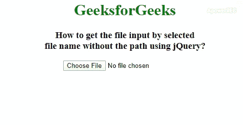

# 如何使用 jQuery 按选择的文件名获取无路径的文件输入？

> 原文:[https://www . geeksforgeeks . org/如何通过不使用路径的选定文件名输入文件-jquery/](https://www.geeksforgeeks.org/how-to-get-file-input-by-selected-file-name-without-path-using-jquery/)

任务是使用 jQuery 通过选定的文件名获取文件输入，而不需要路径。要选择文件我们将使用 [**HTML <输入 type="file" >**](https://www.geeksforgeeks.org/html-input-typefile/) 。之后我们将通过使用 jQuery [**change()方法**](https://www.geeksforgeeks.org/jquery-change-with-examples/) 获得文件名。这个方法在 JQuery 中使用，通过选定的文件名获取输入的文件。而 [**HTML <输入类型=“文件”>**](https://www.geeksforgeeks.org/html-input-typefile/) 用于指定文件选择字段并添加按钮选择要上传到表单的文件。
**语法:**

*   [**jQuery change()方法:**](https://www.geeksforgeeks.org/jquery-change-with-examples/)T4】

```html
$(selector).change(function)
```

*   [**HTML <输入 type="file" > :**](https://www.geeksforgeeks.org/html-input-typefile/)

```html
<input type="file"> 
```

以下示例说明了这种方法:
**示例 1:** 在本例中，我们将使用 change()方法显示扩展名为的文件名，并通过 HTML <输入 type="file" >选择文件。

## 超文本标记语言

```html
<!DOCTYPE html>
<html>

<head>
    <title>
        How to get the file input by selected file
        name without the path using jQuery?
    </title>

    <style>
        h1 {
            color: green;
        }

        body {
            text-align: center;
        }

        h4 {
            color: purple;
        }
    </style>
    <script src=
"https://code.jquery.com/jquery-1.12.4.min.js">
    </script>
</head>

<body>
    <h1>
        GeeksforGeeks
    </h1>

    <h3>
        How to get the file input by selected<br>
        file name without the path using jQuery?
    </h3>

    <input type="file" id="geeks">
    <h4><!-- Selected file will get here --></h4>

    <script>
        $(document).ready(function() {
            $('input[type="file"]').change(function(e) {
                var geekss = e.target.files[0].name;
                $("h4").text(geekss + ' is the selected file.');

            });
        });
    </script>
</body>

</html>   
```

**输出:**



**示例 2:** 在本例中，我们将使用 change()方法通过警报显示扩展名为的文件名，该文件将由 HTML <输入 type="file" >选择。

## 超文本标记语言

```html
<!DOCTYPE html>
<html>

<head>
    <title>
        How to get the file input by selected file
        name without the path using jQuery?
    </title>

    <style>
        h1 {
            color: green;
        }

        body {
            text-align: center;
        }

        h4 {
            color: purple;
        }
    </style>
    <script src=
"https://code.jquery.com/jquery-1.12.4.min.js">
    </script>
</head>

<body>
    <h1>
        GeeksforGeeks
    </h1>

    <h3>
        How to get the file input by selected<br>
        file name without the path using jQuery?
    </h3>

    <input type="file" id="geeks">
    <h4><!-- Selected file will get here --></h4>

    <script>
        $(document).ready(function(){
            $('input[type="file"]').change(function(e){
                var geekss = e.target.files[0].name;
                alert(geekss + ' is the selected file .');
            });
        });
    </script>
</body>

</html>   
```

**输出:**


jQuery 是一个开源的 JavaScript 库，它简化了 HTML/CSS 文档之间的交互，它以其“少写多做”的理念而闻名。
跟随本 [jQuery 教程](https://www.geeksforgeeks.org/jquery-tutorials/)和 [jQuery 示例](https://www.geeksforgeeks.org/jquery-examples/)可以从头开始学习 jQuery。