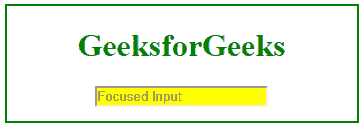
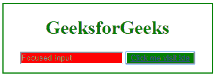

# 如何使用 jQuery 获取聚焦元素？

> 原文:[https://www . geesforgeks . org/how-to-focused-element-use-jquery/](https://www.geeksforgeeks.org/how-to-get-focused-element-using-jquery/)

为了关注元素，jQuery 中有一个内置的选择器，用于检测当前关注的元素。当通过鼠标点击或者通过标签导航按钮聚焦元素时，这个选择器返回所选择的元素。您可以在 JQuery 中添加元素，轻松地聚焦该元素。这里我们将使用 JQuery 内置选择器 [$(":focus")](https://www.geeksforgeeks.org/jquery-focus-with-examples/)

**语法:**

```
$(":focus")
```

**示例 1:** 这个示例展示了如何使用 jQuery 聚焦一个元素。

```
<!DOCTYPE html>
<html>

<head>
    <title>
        How to get focused element
        using jQuery?
    </title>

    <script src=
"https://ajax.googleapis.com/ajax/libs/jquery/3.4.1/jquery.min.js">
    </script>

    <script>
        $(document).ready(function() {
            $("input").focus();
            $(":focus").css("background-color", "yellow");
        });
    </script>

    <style>
        .geeks {
            width: 350px;
            height: 100px;
            border: 2px solid green;
            padding-bottom: 15px;
            margin: 10px;
        }
        h1 {
            color:green;
        }
    </style>
</head>

<body>
    <center>
        <div class="geeks">
            <h1>GeeksforGeeks</h1>
            <input type="text" placeholder="Focused Input" />
        </div>
    </center>
</body>

</html>                    
```

**输出:**


**例 2:**

```
<!DOCTYPE html>
<html>

<head>
    <title>
        How to get focused element
        using jQuery?
    </title>

    <script src=
"https://ajax.googleapis.com/ajax/libs/jquery/3.4.1/jquery.min.js">
    </script>

    <script>
        $(document).ready(function(){
            $("input").focus();
            $(":focus").css("background-color", "red");
            $("button").focus();
            $(":focus").css("background-color", "green");
        });
    </script>

    <style>
         .geeks {
            width: 350px;
            height: 100px;
            border: 2px solid green;
            padding-bottom: 15px;
            margin: 10px;
        }
        h1 {
            color:green;
        }
    </style>
</head>

<body>
    <center>
        <div class="geeks">
            <h1>GeeksforGeeks</h1>
            <input type="text" placeholder="Focused Input" />
            <button type="button" >
                <a href="https://ide.geeksforgeeks.org/tryit.php">
                    Click me visit ide
                </a>
            </button>
        </div>
    </center>
</body>

</html>
```

**输出:**
