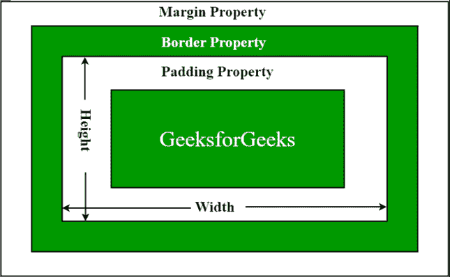

# 如何使用 jQuery 获取元素的内部宽度(不包括边框)？

> 原文:[https://www . geeksforgeeks . org/如何使用-jquery/](https://www.geeksforgeeks.org/how-to-get-inner-width-excluding-the-border-of-an-element-using-jquery/) 获取不包括元素边框的内部宽度

我们可以使用**jQuery[**inner width()**](https://www.geeksforgeeks.org/jquery-innerwidth-with-example/)方法得到任意元素的内部宽度。 **innerWidth()** 方法返回第一个匹配元素的内部宽度，包括填充但不包括边框。**

****语法:****

```html
$(selector).innerWidth()
```

**所以元素的内部宽度如下图所示。**

**

内部宽度** 

**元素的内部宽度是元素宽度和元素周围填充的总和。在计算任何元素的内部宽度时，我们不包括[边框](https://www.geeksforgeeks.org/css-borders/)和[边距](https://www.geeksforgeeks.org/css-margins-padding/)。**

****示例:**以下示例通过使用按钮 [**单击**](https://www.geeksforgeeks.org/jquery-click-with-examples/) 事件演示了 HTML 的“[p”](https://www.geeksforgeeks.org/html-paragraph/)元素的内部宽度。**

## **超文本标记语言**

```html
<!DOCTYPE html>
<html>
  <head>
    <!-- jQuery library -->
    <script src=
"http://ajax.googleapis.com/ajax/libs/jquery/1.4.2/jquery.min.js"
            type="text/javascript">
    </script>
  </head>

  <body>
    <p>Hello</p>

    <button>Click to know the inner width of p tag</button>
    <script>
      $("button").click(function () {
        $("p").text("Inner Width : " + $("p").innerWidth());
      });
    </script>
  </body>
</html>
```

****输出:****

**

单击获取内部宽度**