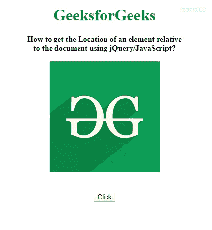

# 如何使用 jQuery 获取一个元素相对于文档或父元素的位置？

> 原文:[https://www . geeksforgeeks . org/如何使用-jquery/](https://www.geeksforgeeks.org/how-to-get-position-of-an-element-relative-to-the-document-or-parent-using-jquery/) 获取元素相对于文档或父元素的位置

为了获得一个元素相对于文档的位置，使用了 jQuery **[offset()方法](https://www.geeksforgeeks.org/jquery-offset-with-examples/)** 。 **[偏移()方法](http://geeksforgeeks.org/jquery-offset-with-examples/)** 是 jQuery 中的内置方法，用于设置或返回所选元素的偏移坐标。我们也可以使用 jQuery **[位置()方法](https://www.geeksforgeeks.org/jquery-position-with-examples/)** 。position()方法是 jQuery 中的一个内置方法，用于查找 DOM 树中第一个匹配元素相对于其父元素的位置。

**语法:**

```html
$(selector).offset()
```

以下示例说明了上述方法:

**例 1:**

```html
<!DOCTYPE html>
<html>

<head>
    <title>
        How to get the Location of
        an element relative to the 
        document using jQuery?
    </title>

    <style>
        h1 {
            color: green;
        }

        body {
            text-align: center;
        }
    </style>

    <script src=
"https://code.jquery.com/jquery-1.12.4.min.js">
    </script>
</head>

<body>
    <h1>GeeksforGeeks</h1>

    <b> 
        How to get the Location of an
        element relative<br> to the 
        document using jQuery/JavaScript? 
    </b>
    <br><br>

    <div id="Logo">
        
    </div>

    <br><br>

    <button type="button">Click</button>

    <h4></h4>

    <script>
        $(document).ready(function() {
            $("button").click(function() {
                var offset = $("#Logo").offset();
                $("h4").text("Location of the box is: (left: " + 
                    offset.left + ", top: " + offset.top + ")");
            });
        });
    </script>
</body>

</html>
```

**输出:**


**例 2:**

```html
<!DOCTYPE html>
<html>

<head>
    <title>
        How to get the Location of
        an element relative to the
        document using jQuery?
    </title>

    <style>
        h1 {
            color: green;
        }

        body {
            text-align: center;
        }
    </style>

    <script src=
"https://code.jquery.com/jquery-1.12.4.min.js">
    </script>
</head>

<body>
    <h1>GeeksforGeeks</h1>

    <b> 
        How to get the Location of an
        element relative<br> to the 
        document using jQuery/JavaScript? 
    </b>
    <br><br>

    <div id="Logo">
        
    </div>
    <br><br>

    <button type="button">Click</button>
    <h4></h4>

    <script>
        $(document).ready(function() {
            $("button").click(function(){
                var position = $("#Logo").position();
                $("h4").text("Location of the Logo is: (left: " 
                + position.left + ", top: " + position.top + ")");
            });
        });
    </script>
</body>

</html>
```

**输出:**
