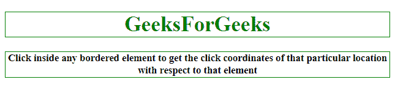
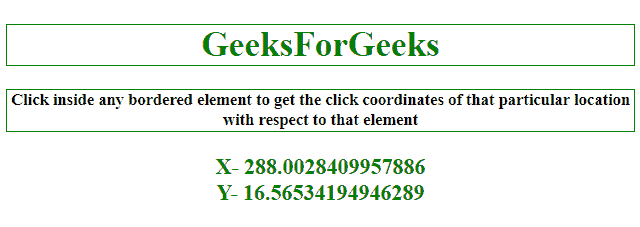
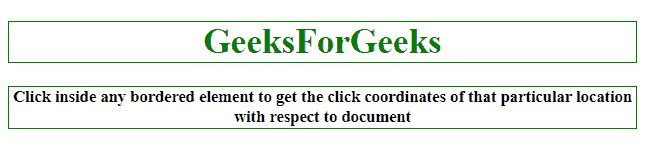
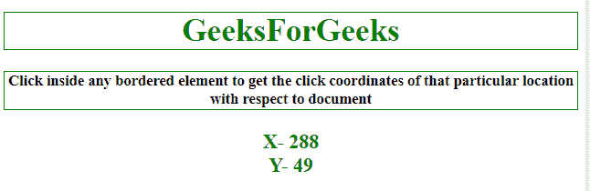

# 如何使用 JQuery 获取目标元素上的相对点击坐标？

> 原文:[https://www . geeksforgeeks . org/如何使用-jquery/](https://www.geeksforgeeks.org/how-to-get-relative-click-coordinates-on-the-target-element-using-jquery/) 获取目标元素上的相对点击坐标

下面是获取元素坐标的代码，这里讨论了两种方法，一种是计算相对于其父元素的位置，另一种是计算相对于文档的位置。

**方法 1:**

*   将单击事件附加到元素。
*   事件发生时调用匿名函数。
*   通过减去偏移量()计算相对于父元素的 X。pageX 属性中的 left 属性。
*   同样，通过减去偏移量()计算相对于父元素的 Y。pageY 属性中的顶级属性。

**示例 1:** 该示例遵循上面讨论的方法来计算位置相对于其父元素的相对位置。

```html
<!DOCTYPE HTML>
<html>

<head>
    <title>
        How to get relative click coordinates
      on the target element using JQuery?
    </title>
    <script src=
"https://ajax.googleapis.com/ajax/libs/jquery/3.4.1/jquery.min.js">
    </script>
    <style>
        h1 {
            border: 1px solid green;
        }

        #GFG_UP {
            border: 1px solid green;
        }

        button {
            border: 1px solid green;
        }
    </style>
</head>

<body style="text-align:center;" id="body">
    <h1 style="color:green;">  
            GeeksForGeeks  
        </h1>
    <p id="GFG_UP" style="font-size: 15px;
              font-weight: bold;">
    </p>
    <p id="GFG_DOWN" style="color:green;
              font-size: 20px; 
              font-weight: bold;">
    </p>
    <script>
        var el_up = document.getElementById("GFG_UP");
        var el_down = document.getElementById("GFG_DOWN");
        var x, y;
        el_up.innerHTML = "Click inside any bordered element to get the"+ 
        "click coordinates of that particular location with respect"+
        "to its parent element ";
        $('h1').click(function(e) {
            // element that has been clicked.
            var elm = $(this);

            // getting the respective
            x = e.pageX - elm.offset().left;

            // coordinates of location.
            y = e.pageY - elm.offset().top;
            gfg_Run();
        });
        $('#GFG_UP').click(function(e) {
            var elm = $(this);
            // getting the respective
            x = e.pageX - elm.offset().left;

            // coordinates of location.
            y = e.pageY - elm.offset().top;
            gfg_Run();
        });

        function gfg_Run() {
            el_down.innerHTML = "X- " + x + "<br>Y- " + y;
        }
    </script>
</body>

</html>
```

**输出:**

*   **点击按钮前:**
    
*   **点击按钮后:**
    

**方法 2:**

*   将单击事件附加到元素。
*   事件发生时调用匿名函数。
*   通过 pageX 属性计算相对于文档的 X。
*   同样，通过 pageY 属性计算相对于文档的 Y。

**示例 2:** 该示例遵循上面讨论的方法来计算位置相对于文档的相对位置。

```html
<!DOCTYPE HTML>
<html>

<head>
    <title>
        How to get relative click coordinates
      on the target element using JQuery?
    </title>
    <script src=
"https://ajax.googleapis.com/ajax/libs/jquery/3.4.1/jquery.min.js">
  </script>
    <style>
        h1 {
            border: 1px solid green;
        }

        #GFG_UP {
            border: 1px solid green;
        }

        button {
            border: 1px solid green;
        }
    </style>
</head>

<body style="text-align:center;" id="body">
    <h1 style="color:green;">  
            GeeksForGeeks  
        </h1>
    <p id="GFG_UP"
       style="font-size: 15px; 
              font-weight: bold;">
    </p>
    <p id="GFG_DOWN" 
       style="color:green;
              font-size: 20px; 
              font-weight: bold;">
    </p>
    <script>
        var el_up = document.getElementById("GFG_UP");
        var el_down = document.getElementById("GFG_DOWN");
        var x, y;
        el_up.innerHTML = "Click inside any bordered element "+
          "to get the click coordinates of that particular "+
          "location with respect to document";
        $('h1').click(function(e) {

          // element that has been clicked.
            var elm = $(this); 

          // getting the respective
            x = e.pageX; 

          // coordinates of location.
            y = e.pageY; 
            gfg_Run();
        });
        $('#GFG_UP').click(function(e) {
            // element that has been clicked.
            var elm = $(this);

            // getting the respective
            x = e.pageX;

            // coordinates of location.
            y = e.pageY;
            gfg_Run();
        });

        function gfg_Run() {
            el_down.innerHTML = "X- " + x + "<br>Y- " + y;
        }
    </script>
</body>

</html>
```

**输出:**

*   **点击按钮前:**
    
*   **点击按钮后:**
    