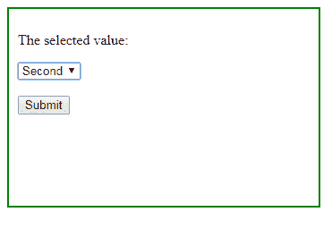
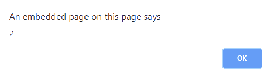
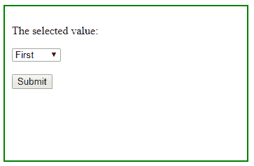
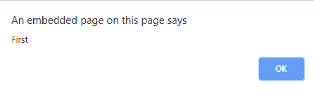

# 如何使用 jQuery 从下拉列表中获取选中的文本？

> 原文:[https://www . geesforgeks . org/如何从下拉列表中选择文本-使用-jquery/](https://www.geeksforgeeks.org/how-to-get-selected-text-from-a-drop-down-list-using-jquery/)

我们可以选择文本，也可以使用**选项:选择**属性或使用 jQuery 中的 **val()** 方法在下拉列表中找到文本的位置。

**通过使用 [val()方法](https://www.geeksforgeeks.org/jquery-val-with-examples/):**
**val()**方法是 jQuery 中的一个内置方法，用于返回或设置所选元素的属性值。

**语法:**

```html
$(selector).val(parameter)

```

**参数:**参数可选。

**示例:**

```html
<html>
<head>
    <title>jQuery Selector</title>
<script src=
"https://ajax.googleapis.com/ajax/libs/jquery/3.3.1/jquery.min.js">
</script>
    <script>
        $(document).ready(function() {
            $("#submit").click(function() {
                alert($("#myselection").val());
            });
        });
    </script>
    <style>
        div {
            width: 50%;
            height: 200px;
            padding: 10px;
            border: 2px solid green;
        }
    </style>
</head>

<body>
    <div>

        <p>The selected value:</p>
        <select id="myselection">
            <option value="1">First</option>
            <option value="2">Second</option>
        </select>
        <br>
        <br>
        <button id="submit">Submit</button>

    </div>
</body>
</html>
```

**输出:**
之前点击按钮。

点击按钮后。


**使用选项:选中:**
**选项:选中**方法是 jQuery 中的一种方式，用于从元素列表中返回所选元素。

**语法:**

```html
 $("#selector option:selected");

```

**参数:**不需要参数。

**示例:**

```html
<html>
<head>
    <title>jQuery Selector</title>
<script src=
"https://ajax.googleapis.com/ajax/libs/jquery/3.2.1/jquery.min.js">
</script>

    <script>
        $(document).ready(function() {
            $("#submit").click(function() {
                var value = $("#myselection option:selected");
                alert(value.text());
            });
        });
    </script>
    <style>
        div {
            width: 50%;
            height: 200px;
            padding: 10px;
            border: 2px solid green;
        }
    </style>
</head>

<body>
    <div>

        <p>The selected value:</p>
        <select id="myselection">
            <option value="1">First</option>
            <option value="2">Second</option>
        </select>
        <br>
        <br>
        <button id="submit">Submit</button>

    </div>
</body>
</html>
```

**输出:**
之前点击按钮。

点击按钮后。


jQuery 是一个开源的 JavaScript 库，它简化了 HTML/CSS 文档之间的交互，它以其“少写多做”的理念而闻名。
跟随本 [jQuery 教程](https://www.geeksforgeeks.org/jquery-tutorials/)和 [jQuery 示例](https://www.geeksforgeeks.org/jquery-examples/)可以从头开始学习 jQuery。