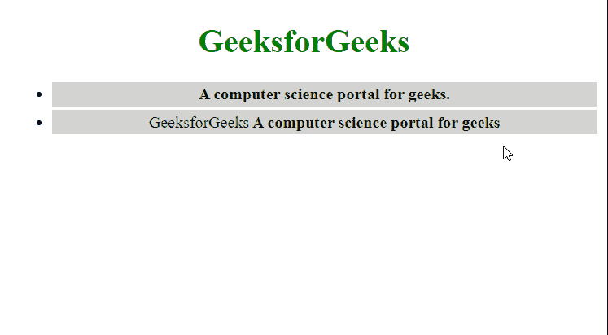

# 如何使用 jQuery 获取/设置包含与指定选择器最接近的父元素匹配的元素？

> 原文:[https://www . geeksforgeeks . org/如何使用-jquery/](https://www.geeksforgeeks.org/how-to-get-set-elements-containing-the-closest-parent-element-matches-the-specified-selector-using-jquery/) 获取包含最接近父元素的集合元素匹配指定的选择器

在本文中，我们将学习如何获取一组元素，这些元素包含与指定选择器匹配的最接近的父元素，即使用 jQuery 包含的起始元素。

**JQuery** 是速度最快且轻量级的 JavaScript 库，用于简化 HTML/CSS 文档(更准确地说是文档对象模型(DOM))和 JavaScript 之间的交互。JQuery 以其座右铭而闻名于世:“少写，多做。”它只是意味着你只需要写几行代码就可以实现你的目标。

**方法:**我们将使用 jQuery 的 [**最近()方法**](https://www.geeksforgeeks.org/jquery-closest-with-examples/) 来达到这个目的。该方法用于通过测试元素本身并遍历 DOM 树中的祖先来访问与选择器匹配的第一个元素。

**语法:**

```html
.closest( selector, context )
```

**参数:**如上所述，它有以下参数，如下所述。

*   **选择器:**指定要在 DOM 树中搜索的元素。这可以是选择器或对元素的引用。
*   **上下文:**这是一个可选参数，在其中可以找到匹配的元素。

以下示例将演示上述方法。

**示例:**

## 超文本标记语言

```html
<!doctype html>
<html lang="en">

<head>
    <style>
        li {
            margin: 3px;
            padding: 3px;
            background: lightgrey;
        }

        li.highlight {
            background: lightgreen;
        }

        body {
            text-align: center;
        }
    </style>
    <script src=
"https://code.jquery.com/jquery-3.5.0.js">
    </script>
</head>

<body>
    <h1 style="color:green">GeeksforGeeks</h1>

    <ul>
        <li><b>A computer science portal for geeks.</b></li>
        <li>GeeksforGeeks<b> A computer science portal
            for geeks</b></li>
    </ul>

    <script>
        $(document).on("click", function (event) {
            $(event.target)
              .closest("li")
              .toggleClass("highlight");
        });
    </script>
</body>

</html>
```

**输出:**

