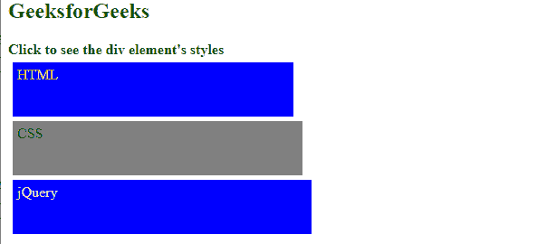
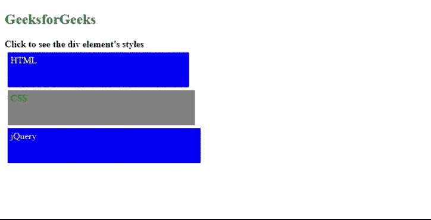

# 如何使用 jQuery 获取被点击分部的样式？

> 原文:[https://www . geeksforgeeks . org/如何使用-jquery/](https://www.geeksforgeeks.org/how-to-get-styles-of-a-clicked-division-using-jquery/) 获取被点击部门的样式

在本文中，我们将学习如何使用 jQuery 获取被点击部分的样式(宽度、高度、文本颜色和背景颜色)。

**方法:**使用 [**css()**](https://www.geeksforgeeks.org/jquery-css-method/) 方法获取 jQuery 中所选元素的 css 属性值。我们在 jQuery 中使用 **css()** 方法，该方法获取属性名称数组并返回该属性的值数组。我们存储这个数组，并使用它来显示所有被点击的 div 的 CSS。

**语法:**

```html
var styles = $(this).css([
    "width",
    "height",
    "color",
    "background-color",
]);
```

**示例:**下面的代码演示了上述方法。为了更好地理解，请参考输出。点击其中一个*分区，*显示*宽度、高度、颜色*和*背景色*属性及其各自的值。

## 超文本标记语言

```html
<!DOCTYPE html>
<html lang="en">

<head>
    <script src=
"https://code.jquery.com/jquery-3.5.0.js">
    </script>

    <style>
        div {
            height: 50px;
            margin: 5px;
            padding: 5px;
        }

        #htmlDivID {
            width: 300px;
            color: yellow;
            background-color: blue;
        }

        #cssDivID {
            width: 310px;
            color: green;
            background-color: grey;
        }

        #jQueryDivID {
            width: 320px;
            color: pink;
            background-color: blue;
        }
    </style>
</head>

<body>
    <h2 style="color:green">
        GeeksforGeeks
    </h2>

    <b>
        Click to see the div
        element's styles
    </b>

    <div id="htmlDivID">HTML</div>
    <div id="cssDivID">CSS</div>
    <div id="jQueryDivID">jQuery</div>
    <br />

    <div id="displayID"></div>

    <script>
        $("div").click(function () {
            var cssValues = [];

            var styles = $(this).css([
                "width",
                "height",
                "color",
                "background-color",
            ]);
            $.each(styles, function (prop, value) {
                cssValues.push("<b>" + prop 
                    + "</b>: " + value + ", ");
            });

            $("#displayID").show().html(cssValues);
        });
    </script>
</body>

</html>
```

**输出:**

*   **点击 div 前:**



*   **点击 div 后:**

