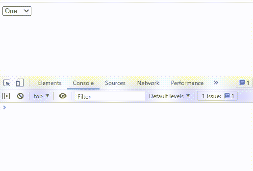

# 如何在 jQuery 中获取选中选项的文本值？

> 原文:[https://www . geesforgeks . org/如何获取 jquery 中选定选项的文本值/](https://www.geeksforgeeks.org/how-to-get-text-value-of-a-selected-option-in-jquery/)

**简介:**在本文中，我们将看到如何使用 jQuery 从所选选项中获取文本值。在处理一些与表单相关的用户界面时，我们经常使用 select 选项，为了使用它，我们肯定需要那些被选中的值。

**方法:**我们将使用[选择](https://www.geeksforgeeks.org/html-select-tag/)选项是制作下拉菜单的一个非常简单的方法，而 [val()](https://www.geeksforgeeks.org/jquery-val-with-examples/) 方法是 jQuery 中的一个内置方法，用于返回或设置所选元素的属性值。此方法适用于 HTML 表单元素。

**语法:**

```html
$(selector).val(parameter)
```

**参数:**该方法不接受任何参数。

**jQuery CDN 链接:**在 HTML 文件的头标签中添加以下代码。

**示例:**在本例中，我们将制作一个 select 选项元素，并在浏览器控制台上打印用户使用上述 val()方法选择的值。

## index.html

```html
<!DOCTYPE html>
<html lang="en">

<head>
    <script src="https://code.jquery.com/jquery-3.6.0.min.js"
        integrity=
    "sha256-/xUj+3OJU5yExlq6GSYGSHk7tPXikynS7ogEvDej/m4="
        crossorigin="anonymous">
    </script>
</head>

<body>
    <select id="selectVal">
        <option value="1">One</option>
        <option value="2">Two</option>
        <option value="3">Three</option>
        <option value="4">Four</option>
        <option value="5">Five</option>
    </select>

    <script>

        // It will print the selected value
        function displayNum() {
            console.log($("select#selectVal").val());
        }

        // When the selected value will change,
        // the above function is called
        $("select#selectVal").change(displayNum);
    </script>
</body>

</html>
```

**输出:**



获取选定的值

现在我们有了一个如何获得这些值的想法，所以我们可以使用这些值，并在任何我们想要的地方使用它，我们不仅限于控制台。