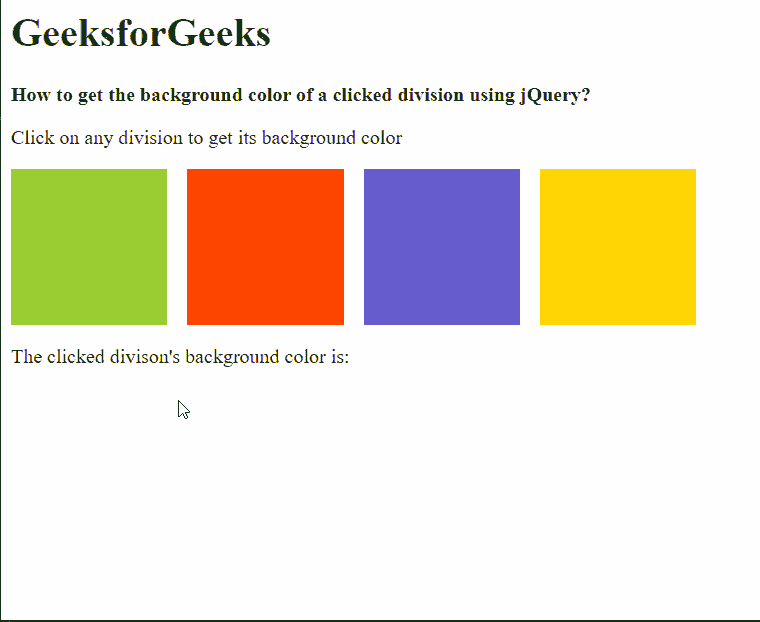

# 如何使用 jQuery 获取被点击分部的背景色？

> 原文:[https://www . geeksforgeeks . org/如何使用-jquery/](https://www.geeksforgeeks.org/how-to-get-the-background-color-of-a-clicked-division-using-jquery/) 获取被点击部门的背景颜色

在本文中，我们将学习如何使用 jQuery 获取被点击的分部的背景色。

**方法:**首先使用公共选择器选择页面上的所有分区，并使用 [**点击()**方法](https://www.geeksforgeeks.org/jquery-click-with-examples/)应用点击绑定来触发颜色检测。然后通过使用*这个*作为选择器，可以找到当前点击的分区。

jQuery 中的 [**css()** 方法](https://www.geeksforgeeks.org/jquery-css-method/)用于获取和设置它所使用的元素的计算样式。它接受两个参数，其中第一个参数定义了我们需要获取或设置样式的样式，第二个参数定义了必须设置的值。我们可以使用这种方法，通过传递参数**“背景色”**来获取当前的背景色。然后，这可以显示为 RGB 值中的文本，或者分配给另一个元素。

**语法:**

```
$(".box").click(function () {

  // Get the current background color
  let current_color = 
    $(this).css("background-color");

  // Show the color text
  $(".current-color-text").text(current_color);

  // Show the color itself
  $(".current-color").css(
    "background-color", current_color
  );
});
```

以下示例说明了上述方法:

**示例:**

## 超文本标记语言

```
<html>
<head>
  <script src=
"https://code.jquery.com/jquery-3.3.1.min.js">
  </script>
  <style>
    .container {
      display: flex;
    }

    .box {
      height: 125px;
      width: 125px;
      margin-right: 16px;
    }

    .yellowgreen-bg {
      background-color: yellowgreen;
    }

    .orangered-bg {
      background-color: orangered;
    }

    .slateblue-bg {
      background-color: slateblue;
    }

    .gold-bg {
      background-color: gold;
    }

    .current-color {
      height: 75px;
      width: 75px;
    }
  </style>
</head>

<body>
  <h1 style="color: green">
    GeeksforGeeks
  </h1>
  <b>How to get the background color of a
    clicked division using jQuery?</b>

<p>
    Click on any division to get its
    background color
  </p>

  <div class="container">

    <!-- Define the division's with
    background color -->
    <div class="box yellowgreen-bg"></div>
    <div class="box orangered-bg"></div>
    <div class="box slateblue-bg"></div>
    <div class="box gold-bg"></div>
  </div>

<p>The clicked division's background color is:</p>

  <!-- Show the color and the text -->
  <div class="current-color"></div>
  <b class="current-color-text"></b>

  <script>
    $(".box").click(function () {

      // Get the current background color
      // using the css() method
      let current_color =
          $(this).css("background-color");

      // Show the color text
      $(".current-color-text").text(
        current_color
      );

      // Show the color itself
      $(".current-color").css(
        "background-color", current_color
      );
    });
  </script>
</body>
</html>
```

**输出:**

