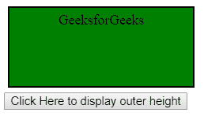

# 如何使用 jQuery 获取 div 的高度？

> 原文:[https://www . geeksforgeeks . org/如何使用-jquery/](https://www.geeksforgeeks.org/how-to-get-the-height-of-a-div-using-jquery/) 获得 div 高度

在本文中，我们将学习如何使用 jQuery 获取 div 的高度。在 jQuery 中，height 方法用于获取 HTML 中任何元素的高度。height 方法设置并返回 HTML 元素的高度。

**方法 1:**[高度()方法](https://www.geeksforgeeks.org/jquery-height-and-innerheight-with-examples/)返回第一个匹配元素的高度，但是高度(值)方法设置所有匹配元素的高度。

```html
// Returns the height of the first matched element
$(selector).height()

// Set the height of the all matched elements
$(selector).height(value);
```

所以借助 height()方法，我们会找到 div 的高度。

```html
// Returns the height of the first matched div
$("div").height()
```

**示例:**

```html
<!DOCTYPE html>
<html lang="en">

<head>
    <meta charset="UTF-8">
    <meta name="viewport" content=
        "width=device-width, initial-scale=1.0">

    <meta http-equiv="X-UA-Compatible" 
                    content="ie=edge">

    <!-- Link of jQuery CDN -->
    <script src=
"https://ajax.googleapis.com/ajax/libs/jquery/3.5.1/jquery.min.js">
    </script>
</head>

<body>

    <!-- div element -->
    <div style="color: red;
               background-color: black;
               margin: 80px 80px;
               padding: 40px 400px;">
        This is the div.
        <p></p>

        <button>
            Click to see the height of div
        </button>
    </div>

    <script>

        // After click btn, it will show
        // the height of the div
        $("button").click(function () {

            // Height of the div
            var height = $("div").height();

            // Show the height of the div
            $("p").html("height of the div :" + height);
        });
    </script>
</body>

</html>
```

**输出:**

**点击按钮前:**


**点击按钮后:**


**方法 2:** **jQuery** 使用 **[innerHeight()](https://www.geeksforgeeks.org/jquery-height-and-innerheight-with-examples/)** 方法检查包含填充的元素的内部高度。

**语法:**

```html
$("param").innerHeight()
```

**示例:**

```html
<!DOCTYPE html>
<html>

<head>
    <script src=
"https://ajax.googleapis.com/ajax/libs/jquery/3.3.1/jquery.min.js">
    </script>

    <style>
        #demo {
            height: 150px;
            width: 350px;
            padding: 10px;
            margin: 3px;
            border: 1px solid blue;
            background-color: lightgreen;
        }
    </style>

    <script>
        $(document).ready(function () {
            $("button").click(function () {
                var msg = "";
                msg += "Inner Height of div: " + $("#demo").
                    innerHeight() + "</br>";
                $("#demo").html(msg);
            });
        });
    </script>
</head>

<body>
    <div id="demo"></div>
    <button>Click Me!!!</button>

    <p>
        Click on the button and check 
        the innerHeight of an element
        (includes padding).
    </p>
</body>

</html>
```

**输出:**
**点击“点击我”按钮前:**

**点击“点击我”按钮后:**


**方法 3:** 该方法使用[外高度()](https://www.geeksforgeeks.org/jquery-outerheight-method/)方法来寻找指定元素的外高度。元素的外部高度包括填充和边框。

**语法:**

```html
$(selector).outerHeight(includeMargin)
```

**示例:**本示例显示元素的外部高度。

```html
<!DOCTYPE html>
<html>

<head>
    <script src=
"https://ajax.googleapis.com/ajax/libs/jquery/3.3.1/jquery.min.js">
    </script>

    <!-- Style to create box using 
        padding and margin -->
    <style>
        .geeks {
            height: 80px;
            width: 200px;
            padding: 5px;
            margin: 5px;
            border: 2px solid black;
            background-color: green;
            text-align: center;
        }
    </style>

    <!-- Script to return outer height -->
    <script>
        $(document).ready(function () {
            $("button").click(function () {
                alert("Outer height of div: "
                    + $("div").outerHeight());
            });
        });
    </script>
</head>

<body>
    <div class="geeks">
        GeeksforGeeks
    </div>

    <button>
        Click Here to display outer height
    </button>
</body>

</html>               
```

**输出:**
**点击按钮前:**

**点击按钮后:**
