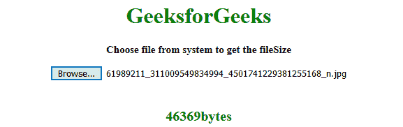
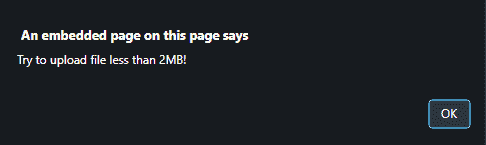

# 如何在 jQuery 中获取输入文件大小？

> 原文:[https://www . geesforgeks . org/如何在 jquery 中获取输入文件大小/](https://www.geeksforgeeks.org/how-to-get-the-input-file-size-in-jquery/)

任务是当用户使用 JQuery 上传文件时获取文件大小。

**进场:**

*   显示文本*从系统中选择文件，在屏幕上获得文件大小*。
*   点击浏览按钮选择上传文件。
*   选择文件后，调用显示所选文件大小的函数。
*   该函数使用 **file.size** 方法以字节为单位显示文件大小。

**示例 1:** 本示例向 input[type=file]元素添加一个事件，当用户上传文件时，文件的大小会打印在屏幕上。

```html
<!DOCTYPE html>
<html>

<head>
    <title>
        How to get the input file size in jQuery ?
    </title>

    <script src=
"https://ajax.googleapis.com/ajax/libs/jquery/3.4.0/jquery.min.js">
    </script>
</head>

<body style="text-align:center;">

    <h1 style="color:green;"> 
        GeeksforGeeks 
    </h1>

    <p id="GFG_UP" style=
        "font-size: 15px; font-weight: bold;">
    </p>

    <input type="file" id="File" />

    <br><br>

    <p id="GFG_DOWN" style=
        "color:green; font-size: 20px; font-weight: bold;">
    </p>

    <script>
        $('#GFG_UP').text("Choose file from system to get the fileSize");
        $('#File').on('change', function() {
            $('#GFG_DOWN').text(this.files[0].size + "bytes");
        });
    </script>
</body>

</html>                    
```

**输出:**

*   **选择文件前:**
    
*   **选择文件后:**
    

**示例 2:** 本示例向 input[type=file]元素添加一个事件，当用户上传文件时，文件的大小会打印在屏幕上。这个例子允许用户上传小于 2MB 的文件。

```html
<!DOCTYPE html>
<html>

<head>
    <title>
        How to get the input file size in jQuery ?
    </title>

    <script src=
"https://ajax.googleapis.com/ajax/libs/jquery/3.4.0/jquery.min.js">
    </script>
</head>

<body style="text-align:center;">
    <h1 style="color:green;"> 
        GeeksforGeeks 
    </h1>

    <p id="GFG_UP" style=
        "font-size: 15px; font-weight: bold;">
    </p>

    <input type="file" id="File" />

    <br><br>

    <p id="GFG_DOWN" style=
        "color:green; font-size: 20px; font-weight: bold;">
    </p>

    <script>
        $('#GFG_UP').text("Choose file from system to get the fileSize");
        $('#File').on('change', function() {
            if (this.files[0].size > 2097152) {
                alert("Try to upload file less than 2MB!");
            } else {
                $('#GFG_DOWN').text(this.files[0].size + "bytes");
            }
        });
    </script>
</body>

</html>                    
```

**输出:**

*   **选择文件前:**
    
*   **选择文件后(大小> 2MB):**
    