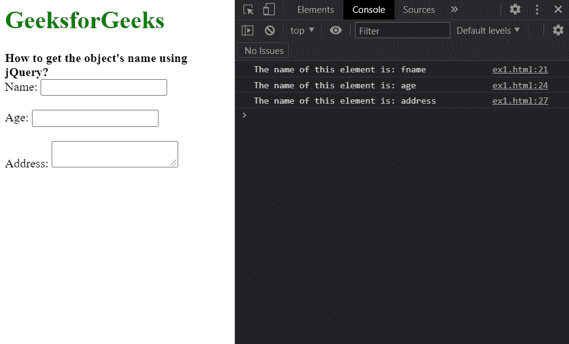

# 如何使用 jQuery 获取对象的名称？

> 原文:[https://www . geesforgeks . org/如何使用-jquery/](https://www.geeksforgeeks.org/how-to-get-the-objects-name-using-jquery/) 获取对象名称

在本文中，我们将学习如何使用 jQuery 查找元素的名称。名称属性可以应用于 HTML 中的多个元素，并用于为任何元素指定名称。使用 **attr()方法可以找出任意元素的名称属性。**该方法用于查找匹配集中第一个元素的任意属性的值。

由于我们需要找到一个元素的名称，我们将在所需的元素上使用这个方法，并在这个方法中传递“name”作为参数。

**语法:**

```
// Select the required element
let selectedElem = $("elemToSelect");

// Get the name of the element
// using thr attr() method
let elementName = selectedElem.attr('name');

console.log("The name of this element is:",
            elementName);
```

下面的示例说明了上述方法:

**示例:**在本例中，我们将使用此方法创建对象的克隆。

## 超文本标记语言

```
<!DOCTYPE html>
<html>

<head>
    <script src=
        "https://code.jquery.com/jquery-3.6.0.min.js">
    </script>
</head>

<body>
    <h1 style="color: green;">
        GeeksforGeeks
    </h1>

    <b>
        How to get the object's name
        using jQuery?
    </b>

    <form>
        <label for="name">Name:</label>
        <input type="text" id="name" name="fname" />
        <br><br>

        <label for="age">Age:</label>
        <input type="number" id="age" name="age" />
        <br><br>

        <label for="address">Address:</label>
        <textarea id="address" name="address"></textarea>
    </form>

    <script>

        // Select the required element
        let selectedElem = $("#name");

        // Get the name of the element
        // using thr attr() method
        console.log("The name of this element is:",
            selectedElem.attr('name'));

        let selectedElem2 = $("#age");
        console.log("The name of this element is:",
            selectedElem2.attr('name'));

        let selectedElem3 = $("#address");
        console.log("The name of this element is:",
            selectedElem3.attr('name'));
    </script>
</body>

</html>
```

**输出:**

