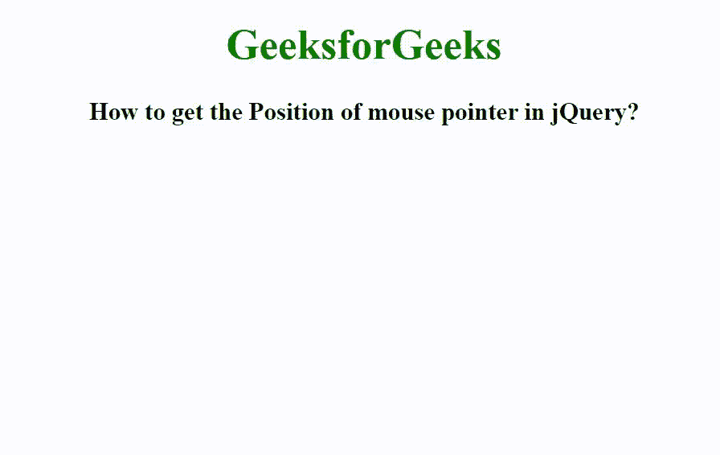

# 如何获取 jQuery 中鼠标指针的位置？

> 原文:[https://www . geeksforgeeks . org/如何获取 jquery 中鼠标指针的位置/](https://www.geeksforgeeks.org/how-to-get-the-position-of-mouse-pointer-in-jquery/)

在本文中，我们将看到如何使用 jQuery 获取鼠标指针的位置。若要获取鼠标指针的位置，请使用 event.pageX 和 event.pageY 属性。event.pageX 属性用于查找鼠标指针相对于文档左边缘的位置。event.pageY 属性用于查找鼠标指针相对于文档上边缘的位置。

**语法:**

```
event.pageX
event.pageY
```

这里，我们使用 on()方法为所选元素附加一个或多个事件处理程序，使用 text()方法设置或返回元素的文本内容

**示例:**

## 超文本标记语言

```
<!DOCTYPE html>
<html>

<head>
    <title>
        How to get the Position of
        mouse pointer in jQuery?
    </title>

    <script src=
"https://ajax.googleapis.com/ajax/libs/jquery/3.3.1/jquery.min.js">
    </script>

    <script>
        $(document).ready(function () {
            $(document).on("mousemove", function (event) {
                $("#GFG").text("Mouse Position (" 
                + event.pageX + ", " + event.pageY + ")");
            });
        });
    </script>

    <style>
        body {
            text-align: center;
        }

        h1 {
            color: green;
        }
    </style>
</head>

<body>
    <h1>GeeksforGeeks</h1>

    <h3>
        How to get the Position of
        mouse pointer in jQuery?
    </h3>

    <div id="GFG"></div>
</body>

</html>
```

**输出:**

