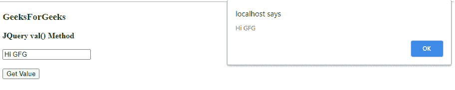
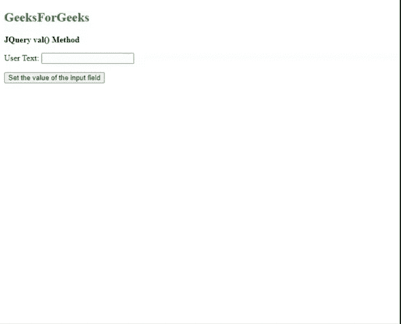

# 如何使用 jQuery 获取输入文本框中的值？

> 原文:[https://www . geeksforgeeks . org/如何使用-jquery 获取输入文本框中的值/](https://www.geeksforgeeks.org/how-to-get-the-value-in-an-input-text-box-using-jquery/)

jQuery [**val()**](https://www.geeksforgeeks.org/jquery-val-with-examples/) 方法用来获取一个元素的值。该函数用于设置或返回值。返回值给出了第一个元素的值属性。在设置值的情况下，它为所有元素设置属性值。这个元素主要用于 HTML 表单。

**语法:**

```html
$(selector).val(function(index, currentvalue))

```

**示例 1:** 该示例是在字段中写入文本的情况下实现的，当单击显示值按钮时，弹出窗口出现并显示输入的文本。

```html
<!DOCTYPE html>
<html lang="en">

<head>
    <script src=
"https://code.jquery.com/jquery-3.4.1.min.js">
    </script>

    <script>
        $(document).ready(function () {

            // On button click, get value
            // of input control Show alert
            // message box
            $("#getValBtnID").click(function () {
                var inputString = $("#userInputID").val();
                alert(inputString);
            });
        });
    </script>
</head>

<body>
    <h3 style="color:green">
        GeeksForGeeks
    </h3>

    <b>JQuery val() Method</b>

    <br><br>

    <input type="text" id="userInputID">
    <br><br>

    <button type="button" id="getValBtnID">
        Get Value
    </button>
</body>

</html>
```

**输出:**


**示例 2:** 该实现显示了点击按钮时的 set value 属性。它会自动调用并使用代码中提到的预定义数据填充文本框。

```html
<!DOCTYPE html>
<html>

<head>
    <script src=
"https://ajax.googleapis.com/ajax/libs/jquery/3.5.1/jquery.min.js">
    </script>

    <script>
        $(document).ready(function () {
            $("#setBtnID").click(function () {
                $("input:text").val("Hello World!");
            });
        });
    </script>
</head>

<body>
    <h2 style="color:green">
        GeeksForGeeks
    </h2>

    <b>JQuery val() Method</b>

    <p>User Text: <input type="text"
        name="userInput">
    </p>

    <button id="setBtnID">
        Set the value of the 
        input field
    </button>
</body>

</html>
```

**输出:**


jQuery 是一个开源的 JavaScript 库，它简化了 HTML/CSS 文档之间的交互，它以其“少写多做”的理念而闻名。
跟随本 [jQuery 教程](https://www.geeksforgeeks.org/jquery-tutorials/)和 [jQuery 示例](https://www.geeksforgeeks.org/jquery-examples/)可以从头开始学习 jQuery。