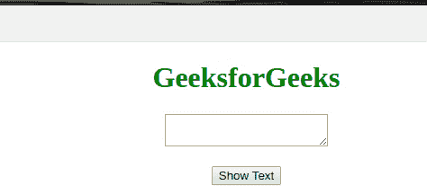

# 如何在 jQuery 中获取一个 textarea 的值？

> 原文:[https://www . geeksforgeeks . org/如何在 jquery 中获取文本区域的价值/](https://www.geeksforgeeks.org/how-to-get-the-value-of-a-textarea-in-jquery/)

借助 [**val()** 方法](https://www.geeksforgeeks.org/jquery-val-with-examples/)，我们可以得到 jQuery 中 **textarea** 的值。 **val()** 方法用于从**文本区**等元素中获取值，输入并选择。此方法只是返回或设置所选元素的 value 属性，主要用于表单元素。当在空集合上调用时，或者当没有给出输入时，它返回未定义或空白的输出。

## 超文本标记语言

```html
<!DOCTYPE html>
<html>
    <head>
        <title>How to get the value of textArea</title>
        <script src=
"https://code.jquery.com/jquery-1.12.4.min.js">
        </script>
    </head>
    <body>
        <center>
            <h1 style="color: green;">GeeksforGeeks</h1>
            <textarea id="txtArea"></textarea><br><br>
            <button id="btn">Show Text</button>
        </center>
    </body>

    <script>
        $(document).ready(function () {

            //This function called when the button is clicked
            $("#btn").click(function () {

                // val() method is used to get the values from 
               // textarea and stored in txt variable
                var txt = $("#txtArea").val();
                alert(txt);
            });
        });
    </script>
</html>
```

**输出:**



jQuery 是一个开源的 JavaScript 库，它简化了 HTML/CSS 文档之间的交互，它以其“少写多做”的理念而闻名。
跟随本 [jQuery 教程](https://www.geeksforgeeks.org/jquery-tutorials/)和 [jQuery 示例](https://www.geeksforgeeks.org/jquery-examples/)可以从头开始学习 jQuery。