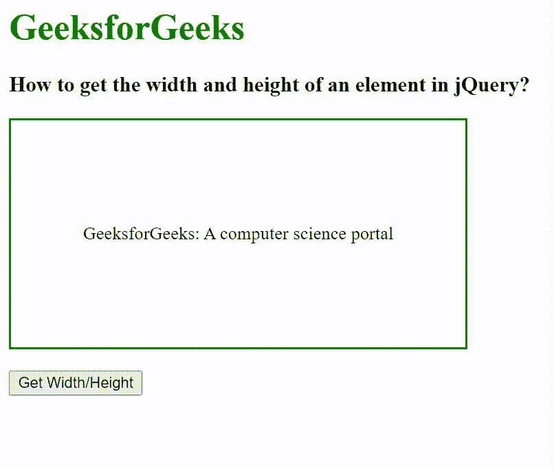

# 如何在 jQuery 中获取一个元素的宽度和高度？

> 原文:[https://www . geeksforgeeks . org/如何获取 jquery 中元素的宽度和高度/](https://www.geeksforgeeks.org/how-to-get-the-width-and-height-of-an-element-in-jquery/)

在本文中，我们将在 jQuery 中找到元素的宽度和高度。为了找到元素的宽度和高度，使用了 width()和 height()方法。width()方法用于检查元素的宽度。它不检查元素的填充、边框和边距。height()方法用于检查元素的高度，但不会检查元素的填充、边框和边距。

**语法:**

```html
$("param").width()
$("param").height()
```

**示例:**

## 超文本标记语言

```html
<!DOCTYpe html>
<html>

<head>
    <title>
        How to get the width and height
        of an element in jQuery?
    </title>

    <script src=
"https://ajax.googleapis.com/ajax/libs/jquery/3.3.1/jquery.min.js">
    </script>

    <style>
        div {
            width: 400px;
            height: 200px;
            display: flex;
            justify-content: center;
            align-items: center;
            border: 2px solid green;
        }
    </style>

    <script>
        $(document).ready(function () {
            $("button").click(function () {
                var div_width = $(".div-class").width();
                var div_height = $(".div-class").height();
                $("#div-width-height").html("Width: " + 
                    div_width + ", " + "Height: " + div_height);
            });
        });
    </script>
</head>

<body>
    <h1 style="color: green;">
        GeeksforGeeks
    </h1>

    <h3>
        How to get the width and height
        of an element in jQuery?
    </h3>

    <div class="div-class">
        GeeksforGeeks: A computer science portal
    </div>
    </br>

    <button>Get Width/Height</button>

    <p id="div-width-height"></p>
</body>

</html>
```

**输出:**

