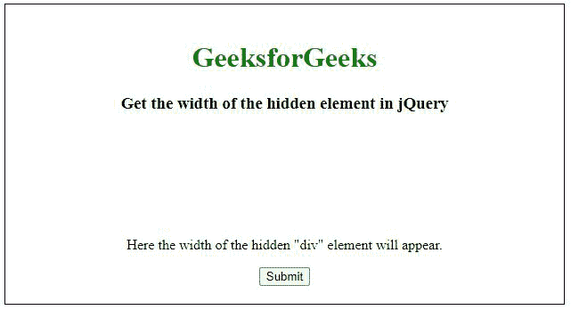
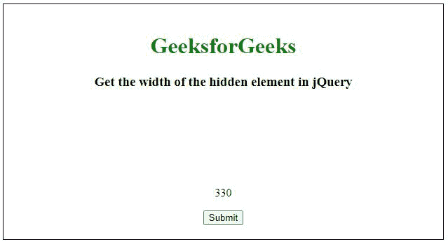
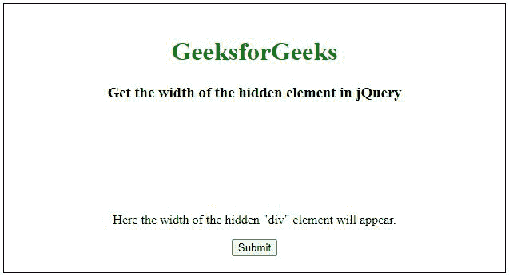
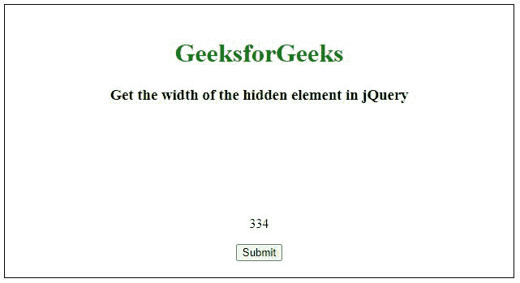

# 如何获取 jQuery 中隐藏元素的宽度？

> 原文:[https://www . geeksforgeeks . org/如何获取 jquery 中隐藏元素的宽度/](https://www.geeksforgeeks.org/how-to-get-the-width-of-hidden-element-in-jquery/)

借助**可以隐藏一个 HTML 元素。hide()** jQuery 函数或者我们可以通过让可见性等于隐藏在 CSS 中来轻松隐藏**。我们可以很容易地在 jQuery 中找到这个隐藏元素的宽度。**

**每个 HTML 元素定义了两种宽度，即元素的**内宽**和**外宽**:**

*   ****innerWidth:** 当所选元素不考虑边框宽度时，会考虑该宽度。**
*   ****外部宽度:**当考虑所选元素的边框宽度时，会考虑该宽度。**

****例 1:** 这个例子展示了如何计算隐藏元素的**内宽**。**

## **超文本标记语言**

```html
<!DOCTYPE html>
<html>

<head>
    <script src=
"https://ajax.googleapis.com/ajax/libs/jquery/3.3.1/jquery.min.js">
    </script>

    <script>
        $(document).ready(function () {
            $("#btn1").click(function () {
                var demo = $("div").innerWidth();
                $("#demo").text(demo);
            });
        }); 
    </script>

    <style>
        div {
            width: 310px;
            height: 80px;
            font-weight: bold;
            color: green;
            font-size: 25px;
            border: 1px solid green;
            visibility: hidden;
            border: 2px solid black;
            padding: 10px;
        }

        body {
            border: 1px solid black;
            padding: 20px;
        }

        h1 {
            color: green;
        }
    </style>
</head>

<body>
    <center>
        <h1>GeeksforGeeks</h1>

        <h3>
            Get the width of the hidden 
            element in jQuery
        </h3>

        <div>

        </div>

        <p id="demo">
            Here the width of the
            hidden "div" element will appear.
        </p>

        <button id="btn1">Submit</button>
    </center>
</body>

</html>
```

****输出:****

*   ****点击按钮前:****

    ****

*   ****点击按钮后:**这里，边框宽度不会加到结果中。**

    ****

****示例 2:** 这个示例展示了如何计算隐藏元素的外部宽度。**

## **超文本标记语言**

```html
<!DOCTYPE html> 
<html> 

<head> 
    <script src= 
"https://ajax.googleapis.com/ajax/libs/jquery/3.3.1/jquery.min.js"> 
    </script> 

    <script> 
        $(document).ready(function() { 
            $("#btn1").click(function() { 
                var demo = $("div").outerWidth(); 
                $("#demo").text(demo); 
            }); 
        }); 
    </script> 

    <style> 
        div { 
            width: 310px; 
            height: 80px; 
            font-weight: bold; 
            color: green; 
            font-size: 25px; 
            border: 1px solid green; 
            visibility: hidden; 
            border: 2px solid black; 
            padding: 10px; 
        } 

        body { 
            border: 1px solid black; 
            padding: 20px; 
        } 
        h1 {
            color: green;
        }
    </style> 
</head> 

<body> 
    <center>
        <h1>GeeksforGeeks</h1> 

        <h3>
            Get the width of the hidden 
            element in jQuery
        </h3> 

        <div> 

        </div> 

        <p id="demo"> 
            Here the width of the  
            hidden "div" element will appear. 
        </p>

        <button id="btn1">Submit</button> 
  </center>
</body> 

</html>
```

****输出:****

*   ****点击按钮前:****

    ****

*   ****点击按钮后:**这里，边框宽度会加到结果中。**

    ****