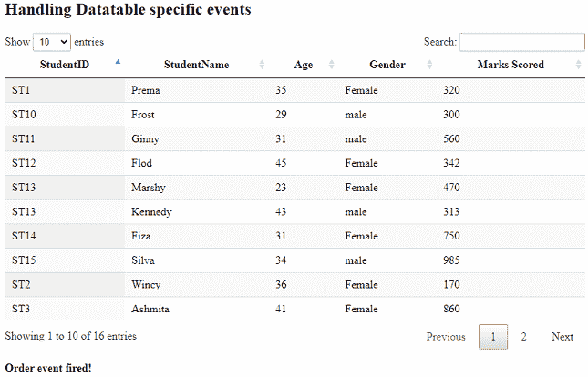
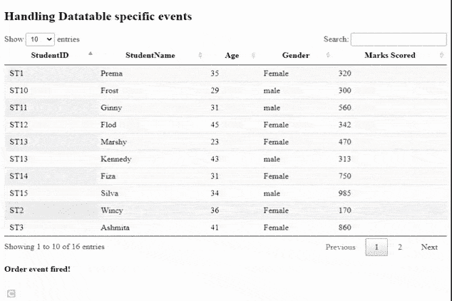

# 如何使用 jQuery DataTable 插件处理 DataTable 特定事件？

> 原文:[https://www . geeksforgeeks . org/如何处理特定于数据表的事件-使用-jquery-datatable-plugin/](https://www.geeksforgeeks.org/how-to-handle-datatable-specific-events-using-jquery-datatable-plugin/)

数据表是一个现代的 jQuery 插件，用于为网页的 HTML 表添加交互式和高级控件。DataTables 是一个简单易用的插件，为开发人员的自定义更改提供了多种选项。DataTable 插件的常见功能是分页、搜索、排序和多列排序。

在本文中，我们将学习处理特定于数据表的顺序和分页事件。数据表还返回许多自定义事件。

实现代码所需的预编译文件有

CSS:

```html
https://cdn.datatables.net/1.10.22/css/jquery.dataTables.min.css
```

**JavaScript :**

```html
//cdn.datatables.net/1.10.22/js/jquery.dataTables.min.js
```

**方法:**处理数据表特定的事件*使用 dt* 命名空间。所有事件都是由 *dt* 命名空间触发的。使用了()上的数据表**方法，自动追加 *dt* 命名空间。当对表中的数据进行排序时，会自动触发 Order 事件。每当使用分页功能时，都会触发分页事件。**

**HTML 表格是用学生数据设计的，以 *id、姓名、年龄、性别*、*标记*为字段。创建带有标识*订单结果标识*和*分页结果标识*的 HTML div，以便在订单和分页事件触发时显示消息。**

****示例:**以下示例代码演示了每当触发 DataTable 特定事件时如何处理函数。下表显示了一条简单的消息。开发人员可以根据应用程序的需要编写函数。**

## **超文本标记语言**

```html
<!DOCTYPE html>
<html>

<head>
    <meta content="initial-scale=1, 
        maximum-scale=1, user-scalable=0"
        name="viewport" />

    <meta name="viewport" content="width=device-width" />

    <!--Datatable plugin CSS file -->
    <link rel="stylesheet" href=
"https://cdn.datatables.net/1.10.22/css/jquery.dataTables.min.css" />

    <!--jQuery library file -->
    <script type="text/javascript" 
        src="https://code.jquery.com/jquery-3.5.1.js">
    </script>

    <!--Datatable plugin JS library file -->
    <script type="text/javascript" src=
"https://cdn.datatables.net/1.10.22/js/jquery.dataTables.min.js">
    </script>
</head>

<body>
    <h2>Handling Datatable specific events</h2>

    <!--HTML tables with student data-->
    <table id="tableID" class="display" 
        style="width:100%">
        <thead>
            <tr>
                <th>StudentID</th>
                <th>StudentName</th>
                <th>Age</th>
                <th>Gender</th>
                <th>Marks Scored</th>
            </tr>
        </thead>

        <tbody>
            <tr>
                <td>ST1</td>
                <td>Prema</td>
                <td>35</td>
                <td>Female</td>
                <td>320</td>
            </tr>
            <tr>
                <td>ST2</td>
                <td>Wincy</td>
                <td>36</td>
                <td>Female</td>
                <td>170</td>
            </tr>
            <tr>
                <td>ST3</td>
                <td>Ashmita</td>

                <td>41</td>
                <td>Female</td>
                <td>860</td>
            </tr>
            <tr>
                <td>ST4</td>
                <td>Kelina</td>
                <td>32</td>
                <td>Female</td>
                <td>433</td>
            </tr>
            <tr>
                <td>ST5</td>
                <td>Satvik</td>
                <td>41</td>
                <td>male</td>
                <td>162</td>
            </tr>
            <tr>
                <td>ST6</td>
                <td>William</td>
                <td>37</td>
                <td>Female</td>
                <td>372</td>
            </tr>
            <tr>
                <td>ST7</td>
                <td>Chandan</td>
                <td>31</td>
                <td>male</td>
                <td>375</td>
            </tr>
            <tr>
                <td>ST8</td>
                <td>David</td>
                <td>45</td>
                <td>male</td>
                <td>327</td>
            </tr>
            <tr>
                <td>ST9</td>
                <td>Harry</td>
                <td>29</td>
                <td>male</td>
                <td>205</td>
            </tr>
            <tr>
                <td>ST10</td>
                <td>Frost</td>
                <td>29</td>
                <td>male</td>
                <td>300</td>
            </tr>
            <tr>
                <td>ST11</td>
                <td>Ginny</td>
                <td>31</td>
                <td>male</td>
                <td>560</td>
            </tr>
            <tr>
                <td>ST12</td>
                <td>Flod</td>
                <td>45</td>
                <td>Female</td>
                <td>342</td>
            </tr>
            <tr>
                <td>ST13</td>
                <td>Marshy</td>
                <td>23</td>
                <td>Female</td>
                <td>470</td>
            </tr>
            <tr>
                <td>ST13</td>
                <td>Kennedy</td>
                <td>43</td>
                <td>male</td>
                <td>313</td>
            </tr>
            <tr>
                <td>ST14</td>
                <td>Fiza</td>
                <td>31</td>
                <td>Female</td>
                <td>750</td>
            </tr>
            <tr>
                <td>ST15</td>
                <td>Silva</td>
                <td>34</td>
                <td>male</td>
                <td>985</td>
            </tr>
        </tbody>
    </table>
    <br />

    <div id="orderResultID"></div>
    <div id="pagingResultID"></div>

    <script>

            /* Initialization of datatables */
            $(document).ready(function () {

                /* events like order and paging are fired */
                    $('#tableID')
                        .on('order.dt', function () {
                            $("#orderResultID").show()
                            .html("<b>Order event fired!</b> ");
                        }
                        ).DataTable();

                $('#tableID').on('page.dt', function () {
                    $("#pagingResultID").show()
                    .html("<b>Paging event fired!</b> ");
                }
                ).DataTable();
            });
    </script>
</body>

</html>
```

****输出:****

****订单事件:****

****

****寻呼事件:****

****