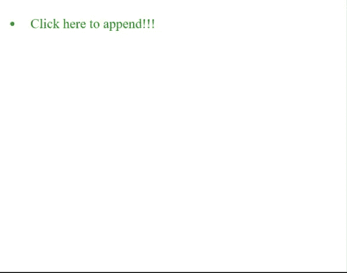
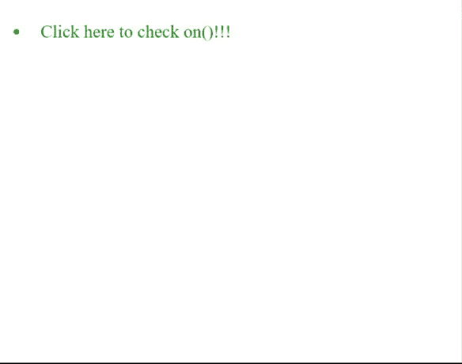
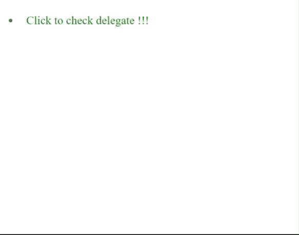

# 如何处理 jQuery 中动态创建的元素中的事件？

> 原文:[https://www . geeksforgeeks . org/如何处理动态创建的事件-jquery 中的元素/](https://www.geeksforgeeks.org/how-to-handle-events-in-dynamically-created-elements-in-jquery/)

当我们想要将任何事件绑定到一个元素时，通常我们可以使用() 方法直接绑定到每个元素的任何事件。

**示例 1:** 本示例使用 jQuery on()方法动态添加段落元素。

```html
<!DOCTYPE html>
<html>

<head>
    <title>
        How to handle events in dynamically 
        created elements in jQuery?
    </title>

    <script src=
"https://ajax.googleapis.com/ajax/libs/jquery/3.3.1/jquery.min.js">
    </script>

    <script>
        $(document).ready(function () {
            $("#list li").on("click", function (event) {
                $('#list').append('<li>New Paragraph</li>');
            });
        }); 
    </script>

    <style>
        li {
            font-size: 30px;
            width: 400px;
            padding: 20px;
            color: green;
        }
    </style>
</head>

<body>
    <!-- Click on this paragraph -->
    <ul id="list">
        <li>Click here to append !!!</li>
    </ul>
</body>

</html>
```

**输出:**


这非常有效，但是当我们添加一个新的列表项并点击它时，什么都没有发生。这是因为在加载文档时，在执行事件处理程序之前附加了事件处理程序。当时只有第一个列表项存在，而没有新的。于是有了**。on()** 方法仅适用于第一个列表项，而不适用于其余列表项。

**示例 2:** 以下示例是使用 **on()** 方法实现的。

```html
<!DOCTYPE html>
<html>

<head>
    <title>
        How to handle events in dynamically 
        created elements in jQuery?
    </title>

    <script src=
"https://ajax.googleapis.com/ajax/libs/jquery/3.3.1/jquery.min.js">
    </script>

    <script>
        $(document).ready(function () {
            $("#list").on("click", 
                    "li", function (event) {
                $('#list').append(
                    '<li>New Paragraph</li>');
            });
        }); 
    </script>

    <style>
        li {
            font-size: 30px;
            width: 400px;
            padding: 20px;
            color: green;
        }
    </style>
</head>

<body>
    <ul id="list">

        <!-- Click on this item -->
        <li>Click here to check on()!!!</li>
    </ul>
</body>

</html>
```

**输出:**


**示例 3:** 以下示例是使用 **delegate()** 函数实现的。为了将事件处理程序绑定到动态创建的元素，我们将使用**事件委托**。单击新列表项时，会执行相同的操作。

事件委托是允许我们将单个事件侦听器附加到父元素的过程，它将为现在存在的或将来添加的所有子元素激发。无论是 [**on()**](https://www.geeksforgeeks.org/jquery-on-with-examples/) 还是 [**delegate()**](https://www.geeksforgeeks.org/jquery-delegate-method/) 功能都允许我们做事件委托。

```html
<!DOCTYPE html>
<html>

<head>
    <title>
        How to handle events in dynamically
        created elements in jQuery?
    </title>

    <script src=
"https://ajax.googleapis.com/ajax/libs/jquery/3.3.1/jquery.min.js">
    </script>

    <script>
        $(document).ready(function () {
            $("#list").delegate("li", 
                "click", function (event) {

                $('#list').append(
                    '<li>New Paragraph</li>');
            });
        }); 
    </script>

    <style>
        li {
            font-size: 30px;
            width: 400px;
            padding: 20px;
            color: green;
        }
    </style>
</head>

<body>
    <ul id="list">

        <!-- Click on this item -->
        <li>Click to check delegate !!!</li>
    </ul>
</body>

</html>
```

**输出:**
