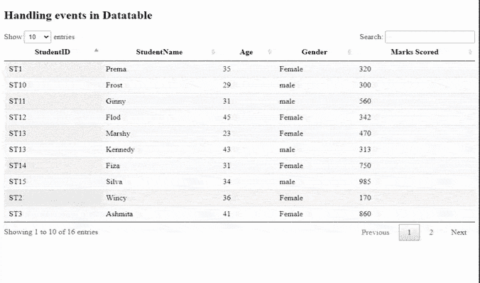

# 如何使用 jQuery DataTables 插件处理事件？

> 原文:[https://www . geesforgeks . org/如何处理事件-使用-jquery-datatables-plugin/](https://www.geeksforgeeks.org/how-to-handle-events-using-jquery-datatables-plugin/)

**DataTables** 是一个现代 jQuery 插件，用于为我们的网页的 HTML 表格添加交互和高级控件。这是一个简单易用的 jQuery 插件，为开发人员的自定义更改提供了大量的选项。数据表的共同特征是排序、搜索、分页和多列排序。

在本文中，我们将学习使用插件处理 jQuery 事件。

需要实现的预编译文件有

*   CSS:

    ```html
    https://cdn.datatables.net/1.10.22/css/jquery.dataTables.min.css
    ```

*   **JavaScript :**

    ```html
    //cdn.datatables.net/1.10.22/js/jquery.dataTables.min.js
    ```

**方法:**我们有一个 HTML 表格，上面有学生的数据，如身份证、姓名、年龄、性别和他们每个人的分数。另一个 id 为*结果 ID* 的“div”用于显示用户触发的事件的结果。插件的数据表是用代码的 JavaScript 部分的表 id 初始化的。事件通过使用 jQuery 的 **on(** )方法来处理。数据表插件的**行()。data()** 方法用于获取用户所选行的信息。

**示例:**以下示例演示了如何使用 DataTable 插件处理 jQuery 事件。

## 超文本标记语言

```html
<!DOCTYPE html>
<html>
   <head>
      <meta content="initial-scale=1, 
                     maximum-scale=1, 
                     user-scalable=0"
            name="viewport" />
      <meta name="viewport" 
            content="width=device-width" />

      <!--Datatable plugin CSS file -->
      <link rel="stylesheet" 
            href=
"https://cdn.datatables.net/1.10.22/css/jquery.dataTables.min.css" />

      <!--jQuery library file -->
      <script type="text/javascript" 
              src=
"https://code.jquery.com/jquery-3.5.1.js"></script>

      <!--Datatable plugin JS library file -->
      <script type="text/javascript" 
              src=
"https://cdn.datatables.net/1.10.22/js/jquery.dataTables.min.js"></script>
   </head>
   <body>
      <h2>Handling events in Datatable </h2>
      <!--HTML tables with student data-->
      <table id="tableID" class="display" 
             style="width:100%">
         <thead>
            <tr>
               <th>StudentID</th>
               <th>StudentName</th>
               <th>Age</th>
               <th>Gender</th>
               <th>Marks Scored</th>
            </tr>
         </thead>
         <tbody>
            <tr>
               <td>ST1</td>
               <td>Prema</td>
               <td>35</td>
               <td>Female</td>
               <td>320</td>
            </tr>
            <tr>
               <td>ST2</td>
               <td>Wincy</td>
               <td>36</td>
               <td>Female</td>
               <td>170</td>
            </tr>
            <tr>
               <td>ST3</td>
               <td>Ashmita</td>
               <td>41</td>
               <td>Female</td>
               <td>860</td>
            </tr>
            <tr>
               <td>ST4</td>
               <td>Kelina</td>
               <td>32</td>
               <td>Female</td>
               <td>433</td>
            </tr>
            <tr>
               <td>ST5</td>
               <td>Satvik</td>
               <td>41</td>
               <td>male</td>
               <td>162</td>
            </tr>
            <tr>
               <td>ST6</td>
               <td>William</td>
               <td>37</td>
               <td>Female</td>
               <td>372</td>
            </tr>
            <tr>
               <td>ST7</td>
               <td>Chandan</td>
               <td>31</td>
               <td>male</td>
               <td>375</td>
            </tr>
            <tr>
               <td>ST8</td>
               <td>David</td>
               <td>45</td>
               <td>male</td>
               <td>327</td>
            </tr>
            <tr>
               <td>ST9</td>
               <td>Harry</td>
               <td>29</td>
               <td>male</td>
               <td>205</td>
            </tr>
            <tr>
               <td>ST10</td>
               <td>Frost</td>
               <td>29</td>
               <td>male</td>
               <td>300</td>
            </tr>
            <tr>
               <td>ST11</td>
               <td>Ginny</td>
               <td>31</td>
               <td>male</td>
               <td>560</td>
            </tr>
            <tr>
               <td>ST12</td>
               <td>Flod</td>
               <td>45</td>
               <td>Female</td>
               <td>342</td>
            </tr>
            <tr>
               <td>ST13</td>
               <td>Marshy</td>
               <td>23</td>
               <td>Female</td>
               <td>470</td>
            </tr>
            <tr>
               <td>ST13</td>
               <td>Kennedy</td>
               <td>43</td>
               <td>male</td>
               <td>313</td>
            </tr>
            <tr>
               <td>ST14</td>
               <td>Fiza</td>
               <td>31</td>
               <td>Female</td>
               <td>750</td>
            </tr>
            <tr>
               <td>ST15</td>
               <td>Silva</td>
               <td>34</td>
               <td>male</td>
               <td>985</td>
            </tr>
         </tbody>
      </table>
      <br/>
      <div id="resultID"></div>
      <script>
         <!--Initialization of datatables -->
          $(document).ready(function() {               

              var datatable = $('#tableID').DataTable();
               <!--On click of one row -->
               $('#tableID tbody').on('click', 'tr', function () 
               {
                  var data = datatable.row( this ).data();
                  <!--It displays the selected user information -->
                  $("#resultID").show().html("<b>User clicked on</b> "
                  +data[0]+' row '+
                  '<b> with Name:</b> '
                  +data[1]+ '<b> ,Age:</b> '+data[2]+'<b> ,Marks:</b> '
                  +data[4]);
             });
         });   

      </script>
   </body>
</html>
```

**输出:**

*   行前点击事件:
    
*   After row-click event:

    