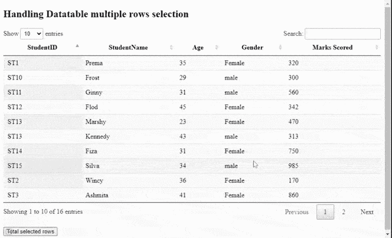
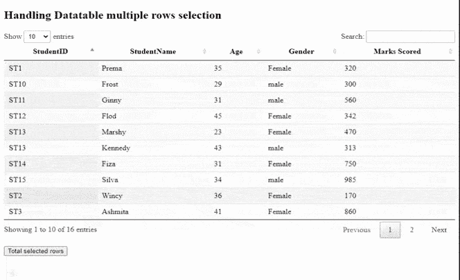
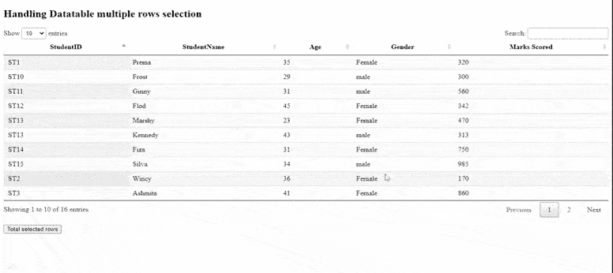

# 如何使用 jQuery DataTables 插件处理多行选择？

> 原文:[https://www . geesforgeks . org/如何处理-多行-选择-使用-jquery-数据表-插件/](https://www.geeksforgeeks.org/how-to-handle-multiple-rows-selection-using-jquery-datatables-plugin/)

Datatables 是一个现代 jQuery 插件，用于为网页的 HTML 表格添加交互式和高级控件。它简单易用，有许多可供开发人员自定义更改的选项。其他常见功能是分页、搜索、排序和多列排序。

在本文中，我们将学习如何处理多行选择。显示了一个非常简单的示例，开发人员可以根据应用程序的需要添加功能。实施所需的预编译文件有:

CSS:

```html
https://cdn.datatables.net/1.10.22/css/jquery.dataTables.min.css
```

**JavaScript:**

```html
https://cdn.datatables.net/1.10.22/js/jquery.dataTables.min.js
```

**方法:**一个简单的*学生*表用于学生详细信息，如*学生证、姓名、年龄、性别、*和*分数*。使用数据表插件初始化该表。单击文本为“所选行总数”的按钮，会给出表格中当前所选行的总数。这是使用插件的行()完成的。data()方法。

**示例:**

## 超文本标记语言

```html
<html>
<head>
  <!--Datatable plugin CSS file -->
  <link rel="stylesheet"
        href=
"https://cdn.datatables.net/1.10.22/css/jquery.dataTables.min.css" />

  <!--jQuery library file -->
  <script type="text/javascript" 
          src="https://code.jquery.com/jquery-3.5.1.js">
  </script>

  <!--Datatable plugin JS library file -->
  <script type="text/javascript" 
          src=
"https://cdn.datatables.net/1.10.22/js/jquery.dataTables.min.js">
  </script>
</head>
<body>
  <h2>Handling Datatable multiple rows selection</h2>

  <!--HTML tables with student data-->
  <table id="tableID" class="display" style="width:100%">
    <thead>
      <tr>
        <th>StudentID</th>
        <th>StudentName</th>
        <th>Age</th>
        <th>Gender</th>
        <th>Marks Scored</th>

      </tr>
    </thead>
    <tbody>
      <tr>
        <td>ST1</td>
        <td>Prema</td>
        <td>35</td>
        <td>Female</td>
        <td>320</td>
      </tr>
      <tr>
        <td>ST2</td>
        <td>Wincy</td>
        <td>36</td>
        <td>Female</td>
        <td>170</td>
      </tr>
      <tr>
        <td>ST3</td>
        <td>Ashmita</td>

        <td>41</td>
        <td>Female</td>
        <td>860</td>
      </tr>
      <tr>
        <td>ST4</td>
        <td>Kelina</td>
        <td>32</td>
        <td>Female</td>
        <td>433</td>
      </tr>
      <tr>
        <td>ST5</td>
        <td>Satvik</td>
        <td>41</td>
        <td>male</td>
        <td>162</td>
      </tr>
      <tr>
        <td>ST6</td>
        <td>William</td>
        <td>37</td>
        <td>Female</td>
        <td>372</td>
      </tr>
      <tr>
        <td>ST7</td>
        <td>Chandan</td>
        <td>31</td>
        <td>male</td>
        <td>375</td>
      </tr>
      <tr>
        <td>ST8</td>
        <td>David</td>
        <td>45</td>
        <td>male</td>
        <td>327</td>
      </tr>
      <tr>
        <td>ST9</td>
        <td>Harry</td>
        <td>29</td>
        <td>male</td>
        <td>205</td>
      </tr>
      <tr>
        <td>ST10</td>
        <td>Frost</td>
        <td>29</td>
        <td>male</td>
        <td>300</td>
      </tr>
      <tr>
        <td>ST11</td>
        <td>Ginny</td>
        <td>31</td>
        <td>male</td>
        <td>560</td>
      </tr>
      <tr>
        <td>ST12</td>
        <td>Flod</td>
        <td>45</td>
        <td>Female</td>
        <td>342</td>
      </tr>
      <tr>
        <td>ST13</td>
        <td>Marshy</td>
        <td>23</td>
        <td>Female</td>
        <td>470</td>
      </tr>
      <tr>
        <td>ST13</td>
        <td>Kennedy</td>
        <td>43</td>
        <td>male</td>
        <td>313</td>
      </tr>
      <tr>
        <td>ST14</td>
        <td>Fiza</td>
        <td>31</td>
        <td>Female</td>
        <td>750</td>
      </tr>
      <tr>
        <td>ST15</td>
        <td>Silva</td>
        <td>34</td>
        <td>male</td>
        <td>985</td>
      </tr>
    </tbody>
  </table>
  <br />
  <button id="btnID">
    Total selected rows
  </button>
  <br />
  <div id="resultID"></div>
  <script>
    // Initialization of DataTable
    $(document).ready(function () {
      var studentTable = $('#tableID').DataTable();

      // Activate the 'selected' class 
      // on clicking the rows
      $('#tableID tbody').on(
        'click', 'tr', function () {
        $(this).toggleClass('selected');
      });

      $('#btnID').click(function () {

        // Display the total row count 
        // on clicking the button
        var totalCount
          = studentTable.rows('.selected')
        .data().length;
        $("#resultID").show().html(
          "<br /><b>User clicked </b> "
          + totalCount + ' rows ');
      });
    });
  </script>
</body>
</html>
```

**输出:**

*   **行选择前:**



*   **行选择后:**



*   **不同页面的行选择后:**

