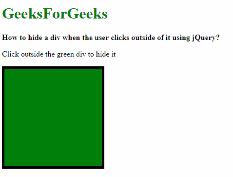
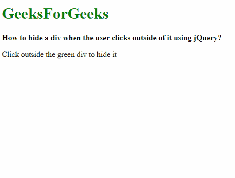

# 如何在用户使用 jQuery 点击 div 外部时隐藏 div？

> 原文:[https://www . geeksforgeeks . org/how-hide-a-div-当用户使用-jquery 点击其外部时/](https://www.geeksforgeeks.org/how-to-hide-a-div-when-the-user-clicks-outside-of-it-using-jquery/)

如果使用两种方法在元素外部单击鼠标，则可以隐藏或显示元素。

**方法 1:使用最接近的方法:**

1.  鼠标上移事件首先在文档

    ```html
    $(document).mouseup(function (e) {
        // rest code here
    }
    ```

    上进行检查
2.  在目标单击时调用最近的()方法。此方法返回 DOM 树中选定元素的第一个祖先。然后在结果上使用 length 属性来找出祖先的数量。如果没有祖先，则意味着单击在元素之外。

    ```html
    if ($(e.target).closest(".container").length === 0) {
        // rest code here
    }
    ```

3.  The element is hidden using the hide() method.

    ```html
    $(".container").hide();
    ```

    **示例:**

    ```html
    <!DOCTYPE html>
    <html>

    <head>
        <title>
            How to hide a div when the user 
            clicks outside of it using jQuery?
        </title>

        <style>
            .container {
                height: 200px;
                width: 200px;
                background-color: green;
                border: 5px solid black;
            }
        </style>

        <script src=
            "https://code.jquery.com/jquery-3.4.0.min.js">
        </script>
    </head>

    <body>
        <h1 style="color: green">
            GeeksForGeeks
        </h1>

        <b>
            How to hide a div when the user clicks
            outside of it using jQuery?
        </b>

        <p>Click outside the green div to hide it</p>

        <div class="container" style="color:green"></div>

        <script type="text/javascript">
            $(document).mouseup(function (e) {
                if ($(e.target).closest(".container").length
                            === 0) {
                    $(".container").hide();
                }
            });
        </script>
    </body>

    </html>                    
    ```

    **输出:**

    *   **点击内部分区:**
        
    *   **点击外部分区:**
        

    **方法二:检查元素是否包含点击目标:**

    1.  鼠标上移事件首先在文档

        ```html
        $(document).mouseup(function (e) {
            // rest code here
        }
        ```

        上进行检查
    2.  The element is checked for 2 things, that the click does not land on the element by passing the is() method and the has() method with the click target.

        is()方法根据指定的元素检查当前元素。click 目标作为参数传递，整个结果被否定，以基本上检查 click 是否在元素之外。

        has()方法用于返回与至少一个传递给此方法的元素相匹配的所有元素。然后在结果中使用 length 属性来检查是否返回了任何元素。如果没有返回任何元素，这意味着单击在元素之外。

        ```html
        if(!container.is(e.target) && container.has(e.target).length === 0) {
            // rest code here
        }
        ```

    3.  The element is hidden using the hide() method.

        ```html
        $(".container").hide();
        ```

        **示例:**

        ```html
        <!DOCTYPE html>
        <html>

        <head>
            <title>
                How to hide a div when the user clicks
                outside of it using jQuery?
            </title>

            <style>
                .container {
                    height: 200px;
                    width: 200px;
                    background-color: green;
                    border: 5px solid black;
                }
            </style>

            <script src=
                "https://code.jquery.com/jquery-3.4.0.min.js">
            </script>
        </head>

        <body>
            <h1 style="color: green">
                GeeksForGeeks
            </h1>

            <b>
                How to hide a div when the user clicks
                outside of it using jQuery?
            </b>

            <p>Click outside the green div to hide it</p>

            <div class="container" style="color:green"></div>

            <script type="text/javascript">
                $(document).mouseup(function (e) {
                    var container = $(".container");
                    if(!container.is(e.target) && 
                    container.has(e.target).length === 0) {
                        container.hide();
                    }
                });
            </script>
        </body>

        </html>
        ```

        **输出:**

        *   **点击内部分区:**
            
        *   **点击外部分区:**
            

        jQuery 是一个开源的 JavaScript 库，它简化了 HTML/CSS 文档之间的交互，它以其“少写多做”的理念而闻名。
        跟随本 [jQuery 教程](https://www.geeksforgeeks.org/jquery-tutorials/)和 [jQuery 示例](https://www.geeksforgeeks.org/jquery-examples/)可以从头开始学习 jQuery。