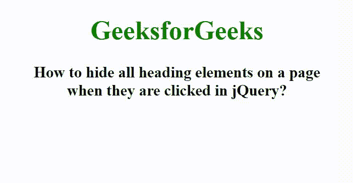

# 在 jQuery 中点击一个页面上的所有标题元素，如何隐藏？

> 原文:[https://www . geeksforgeeks . org/如何在 jquery 中单击页面上的所有标题元素/](https://www.geeksforgeeks.org/how-to-hide-all-heading-elements-on-a-page-when-they-are-clicked-in-jquery/)

在本文中，我们将看到如何在 jQuery 中单击页面上的所有标题元素时隐藏它们。为了隐藏页面中的所有标题元素，我们使用了 slideUp()方法。首先我们使用 [click()方法](https://www.geeksforgeeks.org/jquery-click-with-examples/)检测被点击的元素，然后使用 [slideUp()方法](https://www.geeksforgeeks.org/jquery-slideup-with-examples/)隐藏标题元素。

**语法:**

```
$(selector).click(function() {
    $(this).slideUp();
})
```

这里，我们使用 click()方法来启动 click 事件，或者附加一个函数在 click 事件发生时运行，并使用 slideUp()方法来隐藏选定的元素。

**示例:**

## 超文本标记语言

```
<!DOCTYPE html>
<html>

<head>
    <title>
        How to hide all heading elements on a page
        when they are clicked in jQuery?
    </title>

    <script src=
"https://ajax.googleapis.com/ajax/libs/jquery/3.3.1/jquery.min.js">
    </script>

    <script>
        $(document).ready(function () {
            $("h1, h3").click(function () {
                $(this).slideUp();
            });
        });
    </script>

    <style>
        body {
            text-align: center;
        }

        h1 {
            color: green;
        }
    </style>
</head>

<body>
    <h1>GeeksforGeeks</h1>

    <h3>
        How to hide all heading elements on a page
        <br>when they are clicked in jQuery?
    </h3>
</body>

</html>
```

**输出:**

