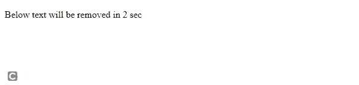
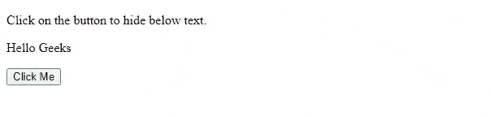

# 如何使用 jQuery 隐藏按钮点击时的 HTML 代码块？

> 原文:[https://www . geesforgeks . org/how-hide-block-of-html-code-on-button-click-use-jquery/](https://www.geeksforgeeks.org/how-to-hide-block-of-html-code-on-a-button-click-using-jquery/)

在本文中，我们将学习如何通过点击按钮隐藏一段 HTML 代码。我们可以通过使用 jQuery 内置的 [**hide()**](https://www.geeksforgeeks.org/jquery-hide-with-examples/) 方法来做到这一点。让我们简单了解一下这个方法的功能。

**hide():** 在 CSS 中，我们有一个属性 [***显示:none***](https://www.geeksforgeeks.org/css-display-property/) 基本上隐藏了元素。jQuery 中的 **[隐藏()方法](https://www.geeksforgeeks.org/jquery-hide-with-examples/)** 也会隐藏选中的元素。

**语法:**

```
$(selector).hide()
```

**示例 1:** 在以下示例中，文本将在 2 秒后隐藏。所选元素将立即隐藏。这和称呼*一样。【显示】【无】* **。**隐藏前， **hide()** 方法将*【display】***属性的值保存在 jQuery 的数据缓存中，这样“ *display* ”就可以在以后恢复到初始值。**

## **超文本标记语言**

```
<!DOCTYPE html>

<head>
    <!-- jQuery library -->
    <script src=
"https://ajax.googleapis.com/ajax/libs/jquery/3.6.0/jquery.min.js">
    </script>
</head>

<body>
    <p>Below text will remove in 2 sec</p>

    <p id="test">
        Hello Geeks
    </p>

    <script>
        setTimeout(function(){
            $("#test").hide()
        },2000)
    </script>
</body>

</html>
```

****输出:****

**

隐藏方法** 

****示例 2:** 在下面的示例中，我们将学习如何使用 jQuery 在按钮点击时隐藏一段 HTML 代码。**

## **超文本标记语言**

```
<!DOCTYPE html>

<head>
    <!-- jQuery library -->
    <script src=
"https://ajax.googleapis.com/ajax/libs/jquery/3.6.0/jquery.min.js">
    </script>
</head>

<body>
    <p>Click on the button to hide below text.</p>

    <p id="test">
        Hello Geeks
    </p>

    <button>Click Me</button>
    <script>
        $('button').click(function(){
            $("#test").hide()
        })
    </script>
</body>
</html>
```

****输出:****

**

点击时隐藏**