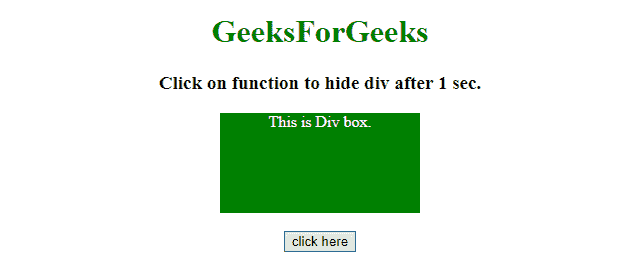
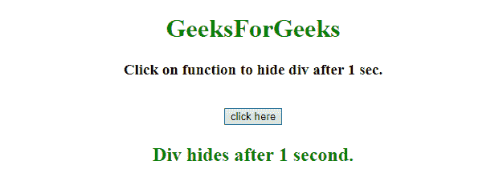

# jQuery 中几秒后如何隐藏 div 元素？

> 原文:[https://www . geeksforgeeks . org/如何在 jquery 中几秒钟后隐藏 div 元素/](https://www.geeksforgeeks.org/how-to-hide-div-element-after-few-seconds-in-jquery/)

给定一个 div 元素，任务是使用 jQuery 在几秒钟后隐藏 div 元素？

**进场:**

*   选择 div 元素。
*   使用延迟函数(setTimeOut()、delay())提供延迟来隐藏()div 元素。

**示例 1:** 在本例中， **setTimeOut()方法**用于为 **fadeOut()方法提供延迟。**

```
<!DOCTYPE HTML> 
<html> 
    <head> 
        <title> 
            How to hide div element after
            few seconds in jQuery ?
        </title>

        <style>
            #div {
                background: green;
                height: 100px;
                width: 200px;
                margin: 0 auto;
                color: white;
            }
        </style>

        <script src = 
"https://ajax.googleapis.com/ajax/libs/jquery/3.4.0/jquery.min.js">
        </script>
    </head> 

    <body style = "text-align:center;"> 

        <h1 style = "color:green;" > 
            GeeksForGeeks 
        </h1>

        <p id = "GFG_UP" style =
            "font-size: 19px; font-weight: bold;">
        </p>

        <div id = "div">
            This is Div box.
        </div>

        <br>

        <button onClick = "GFG_Fun()">
            click here
        </button>

        <p id = "GFG_DOWN" style = 
            "color: green; font-size: 24px; font-weight: bold;">
        </p>

        <script>
            $('#GFG_UP').text("Click on button to hide div after 1 sec.");

            function GFG_Fun() {
                setTimeout(function() {
                    $('#div').fadeOut('fast');
                }, 1000);
                $('#GFG_DOWN').text("Div hides after 1 second."); 
            }
        </script> 
    </body> 
</html>                    
```

**输出:**

*   **点击按钮前:**
    
*   **点击按钮后:**
    

**示例 2:** 在本例中，**延迟()方法**用于向**淡出()方法提供延迟。**

```
<!DOCTYPE HTML> 
<html> 
    <head> 
        <title> 
            How to hide div element after
            few seconds in jQuery ?
        </title>

        <style>
            #div {
                background: green;
                height: 100px;
                width: 200px;
                margin: 0 auto;
                color: white;
            }
        </style>

        <script src = 
"https://ajax.googleapis.com/ajax/libs/jquery/3.4.0/jquery.min.js">
        </script>
    </head> 

    <body style = "text-align:center;"> 

        <h1 style = "color:green;" > 
            GeeksForGeeks 
        </h1>

        <p id = "GFG_UP" style =
            "font-size: 19px; font-weight: bold;">
        </p>

        <div id = "div">
            This is Div box.
        </div>

        <br>

        <button onClick = "GFG_Fun()">
            click here
        </button>

        <p id = "GFG_DOWN" style = 
            "color: green; font-size: 24px; font-weight: bold;">
        </p>

        <script>
            $('#GFG_UP').text("Click on button to hide div after 1 sec.");

            function GFG_Fun() {
                $("#div").delay(1000).fadeOut(500);
                $('#GFG_DOWN').text("Div hides after 1 second.");     
            }
        </script> 
    </body> 
</html>                    
```

**输出:**

*   **点击按钮前:**
    
*   **点击按钮后:**
    