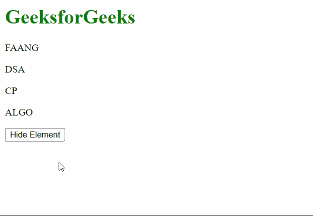

# jQuery 中如何隐藏定义为变量的元素？

> 原文:[https://www . geeksforgeeks . org/如何隐藏元素-在 jquery 中定义为变量/](https://www.geeksforgeeks.org/how-to-hide-elements-defined-as-variables-in-jquery/)

在本文中，我们将学习如何在 jQuery 中隐藏定义为变量的元素。这些可以使用两种方法来完成。

**方法 1:** 在这种方法中，我们将首先选择必须隐藏的元素，然后将其分配给一个变量。我们接下来将把 [**<u>【藏】()</u>**](https://www.geeksforgeeks.org/jquery-hide-with-examples/) 法放在变量上。此方法将对页面隐藏元素。

**示例:**

## 超文本标记语言

```html
<html>
<head>
  <script src=
"https://code.jquery.com/jquery-3.6.0.js">
  </script>
  <script>
    $(document).ready(function () {
      $("button").click(function () {

        // Getting the element with the id
        // of "dsa" in a variable
        let dsaGFG = $("#dsa");

        // Hiding the element using the
        // hide() method
        dsaGFG.hide();
      })
    });
  </script>
</head>

<body>
  <h1 style="color: green;">
    GeeksforGeeks
  </h1>

  <p id="faang">FAANG</p>

  <p id="dsa">DSA</p>

  <p id="cp">CP</p>

  <p id="algo">ALGO</p>

  <button>Hide Element</button>
</body>
</html>
```

**输出:**


**方法 2:** 在这种方法中，我们将首先选择必须隐藏的元素，然后将其分配给一个变量。我们接下来将把[**<u>【addClass()】</u>**](https://www.geeksforgeeks.org/jquery-addclass-with-examples/)**方法放在变量上。这将添加一个我们接下来将创建的 CSS 类。这个 CSS 类将包含设置为*无*的*显示*属性，有效地隐藏了元素。**

****示例:****

## **超文本标记语言**

```html
<html>
<head>
  <style>
    /* Define the class to
       be added */
    .hiddenClass {

      /* Setting the display
         to none hides the element */
      display: none;
    }
  </style>
  <script src=
"https://code.jquery.com/jquery-3.6.0.js">
  </script>
  <script>
    $(document).ready(function () {
      $("button").click(function () {

        // Getting the element with the id
        // of "cp" in a variable
        let cpGFG = $("#cp");

        // Hiding the element by adding a
        // class using the addClass() method
        cpGFG.addClass("hiddenClass");
      })
    });
  </script>
</head>
<body>
  <h1 style="color: green;">
    GeeksforGeeks
  </h1>

  <p id="faang">FAANG</p>

  <p id="dsa">DSA</p>

  <p id="cp">CP</p>

  <p id="algo">ALGO</p>

  <button>Hide Element</button>
</body>
</html>
```

****输出:****

****