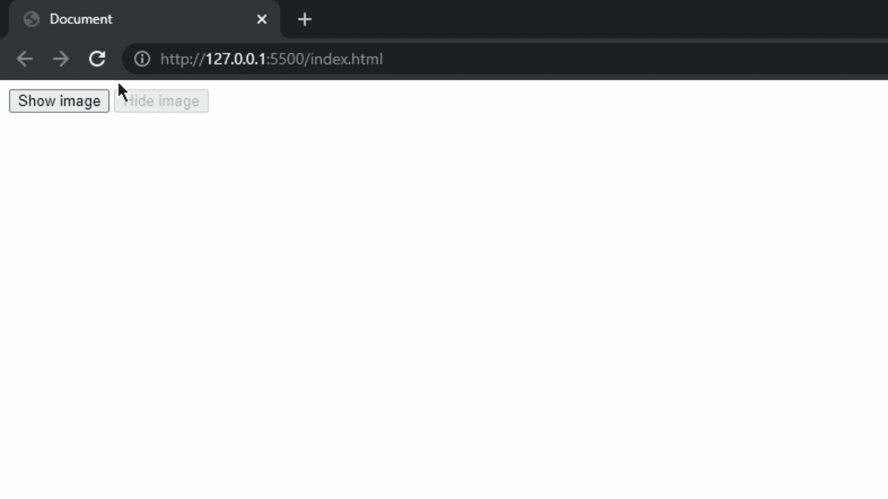

# 如何使用 jQuery 隐藏/显示按钮点击时的图像？

> 原文:[https://www . geesforgeks . org/how-hide-show-a-image-on-button-click-use-jquery/](https://www.geeksforgeeks.org/how-to-hide-show-an-image-on-button-click-using-jquery/)

在本文中，我们将看到当按钮被点击时，我们如何在 jQuery 中隐藏或显示任何特定的图像。对于一些 jQuery 代码行来说，这很容易做到。在我们跳到主题之前，让我们知道 jQuery 的哪些方法将用于此。所以有一个方法叫做 [show()](https://www.geeksforgeeks.org/jquery-effect-show-method/) 还有一个是 [hide()](https://www.geeksforgeeks.org/jquery-hide-with-examples/) ，jQuery 的这两个方法可以让我们的工作轻松很多。

对于本教程，我们将使用 jQuery 的 CDN 链接来使用它。我们必须将以下代码粘贴到标题标签内的 HTML 页面中。这个脚本可以在 [jQuery](https://jquery.com/) 官网找到。

**jQuery CDN 链接:**

现在让我们看看我们将在页面中实现的功能的 jQuery 代码是什么。

## 超文本标记语言

```
<script>
    $(document).ready(function () {
        $("#image").hide();
        $("#hide").attr('disabled', true);
        $("#hide").click(function () {
            $("#image").hide();
            $("#hide").attr('disabled', true);
            $("#show").attr('disabled', false);

        });
        $("#show").click(function () {
            $("#image").show();
            $("#hide").attr('disabled', false);
            $("#show").attr('disabled', true);
        });
    });
</script>
```

上面写的代码将负责隐藏或显示我们网页上的图像。我们使用了 click()方法，当点击 id(hide)按钮时将调用该方法，当点击 id(show)按钮时将调用另一个 click()方法。在这两种 click()方法中，还有两种方法被使用，即隐藏和显示，它们与 id(image)的图像标签相链接。这样点击按钮就可以改变这个图像。我们为按钮增加了一些功能，这样当图像可见时，显示按钮将变灰，当图像不可见时隐藏按钮将变灰，这将为用户提供更多的清晰度。

现在，为了清晰起见，让我们看看我们的 HTML 页面和完整的代码。

**示例:**

## 超文本标记语言

```
<!DOCTYPE html>
<html lang="en">

<head>

    <!-- CDN link of jQuery -->
    <script src=
    "https://code.jquery.com/jquery-3.6.0.min.js"
        integrity=
"sha256-/xUj+3OJU5yExlq6GSYGSHk7tPXikynS7ogEvDej/m4=" 
        crossorigin="anonymous">
    </script>
</head>

<body>

    <!-- Both buttons that will hide
        or show the image -->
    <button id="show">Show image</button>
    <button id="hide">Hide image</button>

    <!-- Image that will follow the 
        commands accordingly -->
    

    <!-- Code for hiding or showing image 
        on button click -->
    <script>
        $(document).ready(function () {
            $("#image").hide();
            $("#hide").attr('disabled', true);
            $("#hide").click(function () {
                $("#image").hide();
                $("#hide").attr('disabled', true);
                $("#show").attr('disabled', false);

            });
            $("#show").click(function () {
                $("#image").show();
                $("#hide").attr('disabled', false);
                $("#show").attr('disabled', true);
            });
        });
    </script>
</body>

</html>
```

现在，为了检查上面的代码，我们必须在浏览器中打开该 HTML 文件，并查看我们已经实现的按钮的功能。

**输出:**

