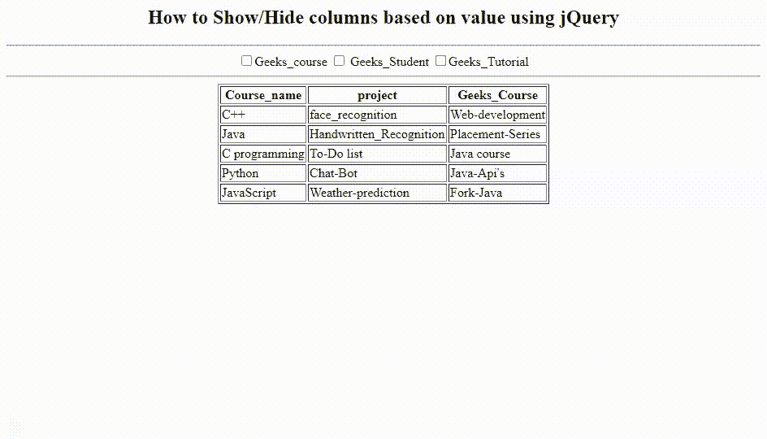

# 如何在 jQuery 中隐藏基于值的复选框？

> 原文:[https://www . geeksforgeeks . org/如何基于 jquery 中的值隐藏复选框/](https://www.geeksforgeeks.org/how-to-hide-the-checkbox-based-on-value-in-jquery/)

复选框用于根据用户希望在界面上看到的内容来设置内容。用户也可以根据自己的意愿设置多个选项。

**语法:**

```html
$('input[name=foo]').attr('checked', false);

```

在上面的语法中，它返回分配给用户选择的表框的选中或未选中复选框的值。如果用户想要查看表格框中的特定内容，那么用户可以选择与他想要的列文本框相关联的复选框。

**示例:**下面的示例说明了该方法。它使用功能**点击()**返回分配给表格框或栏的复选框的值。每当复选框被选中或取消选中时，它会将相应的返回值分配到表框中。

## 超文本标记语言

```html
<!DOCTYPE html>
<html>

<head>
    <center>
        <h2>
            How to Show/Hide checkbox based 
            on value using jQuery
        </h2>

        <hr />
        <input type="checkbox" name="Course">Geeks_course
        <input type="checkbox" name="student"> Geeks_Student
        <input type="checkbox" name="Tutorial">Geeks_Tutorial
        <hr />

        <script src=
"https://ajax.googleapis.com/ajax/libs/jquery/3.5.1/jquery.min.js">
        </script>

        <script>
            $("input:checkbox").attr("checked", 
                    false).click(function () {
                var shcolumn = "." + $(this).attr("name");
                $(shcolumn).toggle();

            });
        </script>

</head>

<body>
    <table border="1">
        <tr>
            <th class="Course">Course_name</th>
            <th class="student">project</th>
            <th class="Tutorial">Geeks_Course</th>
        </tr>
        <tbody>
            <tr>
                <td class="Course">C++</td>
                <td class="student">face_recognition</td>
                <td class="Tutorial">Web-development</td>
            </tr>
            <tr>
                <td class="Course">Java</td>
                <td class="student">Handwritten_Recognition</td>
                <td class="Tutorial">Placement-Series</td>

            </tr>
            <tr>
                <td class="Course">C programming</td>
                <td class="student">To-Do list</td>
                <td class="Tutorial">Java course</td>

            </tr>
            <tr>
                <td class="Course">Python</td>
                <td class="student">Chat-Bot</td>
                <td class="Tutorial">Java-Api's</td>

            </tr>
            <tr>
                <td class="Course">JavaScript</td>
                <td class="student">Weather-prediction</td>
                <td class="Tutorial">Fork-Java</td>

            </tr>
        </tbody>
    </table>
</body>
</center>
</head>

</html>
```

**输出:**

