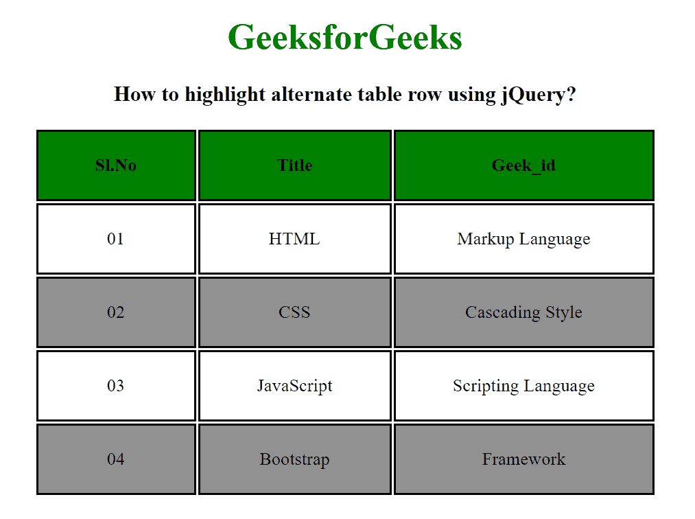

# 如何使用 jQuery 突出显示替代表行？

> 原文:[https://www . geesforgeks . org/how-highlight-alternate-table-row-using-jquery/](https://www.geeksforgeeks.org/how-to-highlight-alternate-table-row-using-jquery/)

在本文中，我们将使用 jQuery 在另一个表行上设置高亮显示。 **[:第 n 个子(2n)](https://www.geeksforgeeks.org/css-nth-child-selector/)** 选择器用于选择备选行， **[addClass()方法](https://www.geeksforgeeks.org/jquery-addclass-with-examples/)** 用于设置备选行的样式。

**语法:**

```
$(tr:nth-child(2n)").addClass("GFG");
```

这里，我们将使用 [<表>标记](https://www.geeksforgeeks.org/html-tables/)创建一个简单的表。[<>](https://www.geeksforgeeks.org/html-thead-tag/)和 [<标签用于创建表格的标题和正文元素。我们使用一些 CSS 属性来设置样式。](https://www.geeksforgeeks.org/html-tbody-tag/)

**示例:**

## 超文本标记语言

```
<!DOCTYPE html>
<html>

<head>
    <title>
        How to highlight alternate
        table row using jQuery?
    </title>

    <script src=
"https://ajax.googleapis.com/ajax/libs/jquery/3.3.1/jquery.min.js">
    </script>

    <style>
        table {
            margin: 0 auto;
        }

        tr,
        th,
        td {
            border: 2px solid black;
            padding: 20px 50px;
        }

        th {
            background-color: green;
        }

        .GFG {
            background: rgb(145, 145, 145);
        }
    </style>

    <script>
        $(document).ready(function () {
            $("table tbody tr:nth-child(2n)").addClass("GFG");
        });
    </script>
</head>

<body style="text-align: center;">
    <h1 style="color:green;">
        GeeksforGeeks
    </h1>

    <h3>
        How to highlight alternate
        table row using jQuery?
    </h3>

    <table>
        <thead>
            <tr>
                <th>Sl.No</th>
                <th>Title</th>
                <th>Geek_id</th>
            </tr>
        </thead>

        <tbody>
            <tr>
                <td>01</td>
                <td>HTML</td>
                <td>Markup Language</td>
            </tr>
            <tr>
                <td>02</td>
                <td>CSS</td>
                <td>Cascading Style</td>
            </tr>
            <tr>
                <td>03</td>
                <td>JavaScript</td>
                <td>Scripting Language</td>
            </tr>
            <tr>
                <td>04</td>
                <td>Bootstrap</td>
                <td>Framework</td>
            </tr>
        </tbody>
    </table>
</body>

</html>
```

**输出:**

