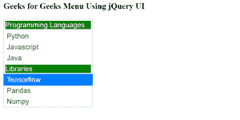

# 如何使用 jQuery UI 实现类别菜单？

> 原文:[https://www . geesforgeks . org/如何实现-类别-菜单-使用-jquery-ui/](https://www.geeksforgeeks.org/how-to-implement-categories-menu-using-jquery-ui/)

在本文中，我们将学习如何配置项目，以便将哪些元素转换为可选菜单项。我们可以使用这种技术来创建类别标题。其余的项目可以选择使用。

**语法:**

```html
$( "#selector" ).menu({ items: "> :not(.selector)" });
```

**参数:**该方法接受一个参数作为项目。

**返回值:**这个方法不返回任何东西。

**需要添加的脚本:**

请首先下载库，然后使用下面给定脚本的路径。

> <rel = "样式表"链接 href = "/resources/demos/style . CSS ">
> <src = " https://code . jquery . com/jquery-1 . 12 . 4 . js ">/script>

**示例:**在本例中，我们创建了两个列表，一个用于编程语言类别，另一个是库。在这里，我们对不同类别的标题都应用了这种方法。

## 超文本标记语言

```html
<!doctype html>
<html lang="en">

<head>
    <meta charset="utf-8">
    <meta name="viewport" content=
        "width=device-width, initial-scale=1">

    <link rel="stylesheet" href=
        "~/jquery-ui-1.12.1.custom//jquery-ui.css">

    <script src=
        "https://code.jquery.com/jquery-1.12.4.js">
    </script>

    <script src=
    "https://code.jquery.com/ui/1.12.1/jquery-ui.js">
    </script>

    <script>
        $(function () {
            $("#menu").menu({
                items: "> :not(.widget-header)"
            });
        });
    </script>
    <style>
        #menu {
            width: 300px;
        }

        .widget-header {
            padding: 0.3em;
            color: white;
        }
    </style>
</head>

<body>
    <h3>Geeks for Geeks Menu Using jQuery UI</h3>

    <ul id="menu">
        <li class="widget-header">
            <div style="background-color: green;">
                Programming Languages
            </div>
        </li>
        <li>
            <div>Python</div>
        </li>
        <li>
            <div>Javascript</div>
        </li>
        <li>
            <div>Java</div>
        </li>
        <li class="widget-header">
            <div style="background-color: green;">
                Libraries
            </div>
        </li>
        <li>
            <div>Tensorflow</div>
        </li>
        <li>
            <div>Pandas</div>
        </li>
        <li>
            <div>Numpy</div>
        </li>
    </ul>
</body>

</html>
```

**输出:**

