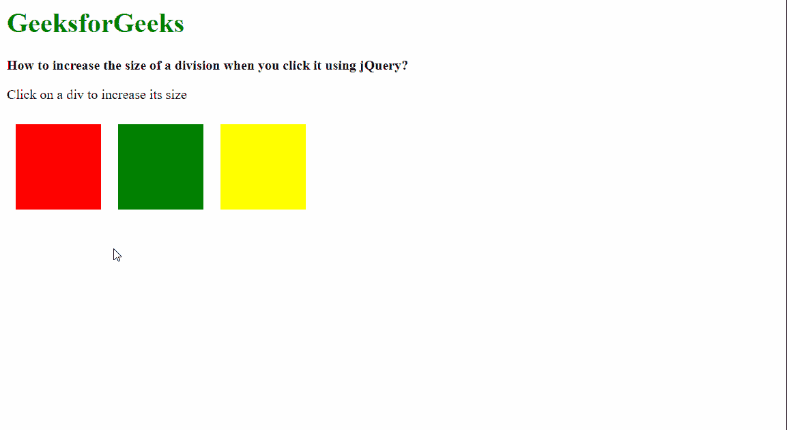
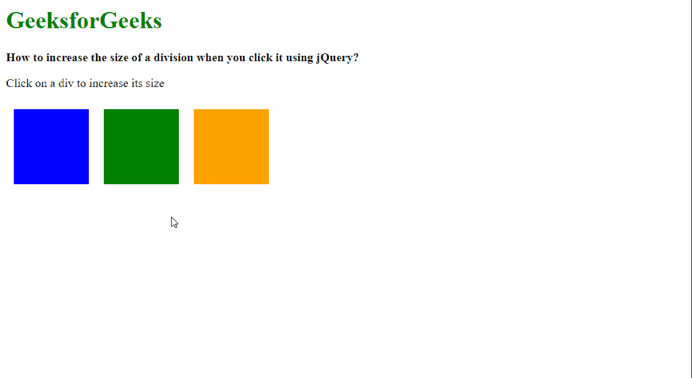

# 使用 jQuery 点击一个分部时，如何增加其大小？

> 原文:[https://www . geeksforgeeks . org/如何在使用 jquery/](https://www.geeksforgeeks.org/how-to-increase-the-size-of-a-division-when-you-click-it-using-jquery/) 点击时增加部门规模

在本文中，我们将学习如何在使用 jQuery 点击一个分部时增加它的大小。

**方法 1:** 使用高度()和宽度()方法。

首先使用公共选择器选择页面上的所有分区，并使用 **click()** 方法应用点击绑定来触发增加大小的功能。然后，通过使用*这个*作为选择器，可以找到当前点击的分区。

使用 [**高度()**方法](https://www.geeksforgeeks.org/jquery-height-and-innerheight-with-examples/)可以找到元素的当前高度，使用 [**宽度()**方法](https://www.geeksforgeeks.org/jquery-width/)可以找到当前宽度。这些临时存储在单独的变量中。然后使用相同的方法设置修改后的高度和宽度。新值可以通过将当前高度和宽度乘以乘数来计算。这个乘数可以指定为一个变量。这将同样增加点击部分的大小。

我们也可以使用不同的乘数来分别增加分割的高度和宽度。

**语法:**

```html
$(".box").click(function () {

  // Select the clicked element
  let curr_elem = $(this);

  // Get the current dimensions
  let curr_width = curr_elem.width();
  let curr_height = curr_elem.height();

  // Set the new dimensions
  curr_elem.height(curr_height * increase_modifier);
  curr_elem.width(curr_width * increase_modifier);
});
```

以下示例说明了上述方法:

**示例:**

## 超文本标记语言

```html
<html>
<head>
  <script src=
"https://code.jquery.com/jquery-3.3.1.min.js">
  </script>
  <style>
    .container {
      display: flex;
    }

    .box {
      height: 100px;
      width: 100px;
      margin: 10px;
    }

    .red-bg {
      background-color: red;
    }

    .green-bg {
      background-color: green;
    }

    .yellow-bg {
      background-color: yellow;
    }
  </style>
</head>
<body>
  <h1 style="color: green">
    GeeksforGeeks
  </h1>
  <b>
    How to increase the size of a 
    division when you click it using jQuery?
  </b>

<p>Click on a div to increase its size</p>

  <div class="container">
    <div class="box red-bg"></div>
    <div class="box green-bg"></div>
    <div class="box yellow-bg"></div>
  </div>

  <script>
    $(".box").click(function () {

      // Select the element that
      // is clicked on
      let curr_elem = $(this);

      // Set the amount to increase
      let increase_modifier = 1.5;

      // Get the current width of the element
      let curr_width = curr_elem.width();

      // Get the current height of the element
      let curr_height = curr_elem.height();

      // Use the same methods to set
      // the new dimensions
      curr_elem.height(
        curr_height * increase_modifier
      );
      curr_elem.width(
        curr_width * increase_modifier
      );
    });
  </script>
</body>
</html>
```

**输出:**



**方法 2:** 使用 [css()方法](https://www.geeksforgeeks.org/jquery-css-method/)。

这类似于上述方法。首先使用公共选择器选择页面上的所有分区，并使用 **click()** 方法应用点击绑定来触发增加大小的功能。然后，通过使用*这个*作为选择器，可以找到当前点击的分区。

使用 **css()** 方法，传递第一个参数为*【高度】**【宽度】*，即可求出元素当前的高度和宽度。这将返回当前分割的高度和宽度。在使用 [**parseInt()** 方法](https://www.geeksforgeeks.org/javascript-parseint-function/)将它们解析为整数后，它们被临时存储在单独的变量中。再次使用 **css()** 方法分配新的高度和宽度，绕过新值作为第二个参数。与上述方法类似，可以通过将当前高度和宽度乘以乘数来计算新值。

**语法:**

```html
$(".box").click(function () {

  // Select the clicked element
  let curr_elem = $(this);

  // Get the current dimensions
  let curr_width = parseInt(curr_elem.css("width"), 10);
  let curr_height = parseInt(curr_elem.css("height"), 10);

  // Set the CSS value of the element
  curr_elem.css({

    // Set the new height and width
    width: curr_width * increase_modifier,
    height: curr_height * increase_modifier,
  });
});
```

**示例:**

## 超文本标记语言

```html
<html>
<head>
  <script src=
"https://code.jquery.com/jquery-3.3.1.min.js">
  </script>
  <style>
    .container {
      display: flex;
    }

    .box {
      height: 100px;
      width: 100px;
      margin: 10px;
    }

    .blue-bg {
      background-color: blue;
    }

    .green-bg {
      background-color: green;
    }

    .orange-bg {
      background-color: orange;
    }
  </style>
</head>

<body>
  <h1 style="color: green">
    GeeksforGeeks
  </h1>
  <b>
    How to increase the size of a 
    division when you click it using jQuery?
  </b>
  <p>Click on a div to increase its size</p>

  <div class="container">
    <div class="box blue-bg"></div>
    <div class="box green-bg"></div>
    <div class="box orange-bg"></div>
  </div>

  <script>
    $(".box").click(function () {

      // Select the element that
      // is clicked on
      let curr_elem = $(this);

      // Set the amount to increase
      let increase_modifier = 1.5;

      // Get the current width of the element
      // and parse the value to integer
      let curr_width = 
          parseInt(curr_elem.css("width"), 10);

      // Get the current height of the element
      // and parse the value to integer
      let curr_height = 
          parseInt(curr_elem.css("height"), 10);

      // Set the CSS value of the element
      curr_elem.css({

        // Set the new height and width
        // after multiplying
        width: curr_width * increase_modifier,
        height: curr_height * increase_modifier,
      });
    });
  </script>
</body>
</html>
```

**输出:**

