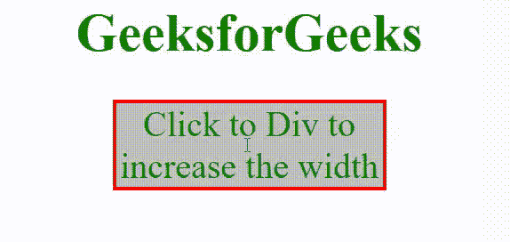

# 如何使用 jQuery 点击一个 div 后，将其宽度增加指定像素？

> 原文:[https://www . geeksforgeeks . org/如何使用-jquery/](https://www.geeksforgeeks.org/how-to-increase-the-width-of-a-div-by-specified-pixels-once-it-is-clicked-using-jquery/) 增加指定像素的宽度

在本文中，我们将学习如何在使用 jQuery 单击一个分区后，将其宽度增加指定的像素。

我们可以使用 [**width()**](https://www.geeksforgeeks.org/jquery-width/) 方法来完成这个任务，该方法用于在 JQuery 中返回和设置元素的宽度。因此，当我们单击它时，会调用一个函数，首先使用 width()方法将 div 的当前宽度存储在一个变量中，然后增加指定的像素，并使用 JQuery 中的 width(value)方法设置其宽度。

**语法:**

```html
// To return the width of the selected element
$(selector).width()

// To set the width of the selected element
$(selector).width(value)
```

**示例:**

## 超文本标记语言

```html
<!DOCTYPE html>
<html lang="en">

<head>
    <script src=
"https://code.jquery.com/jquery-3.5.0.js">
    </script>

    <style>
        body {
            color: green;
            font-size: 30px;
        }

        div {
            font-size: 40px;
            background-color: rgb(190, 190, 190);
            width: 300px;
            border: solid 4px red;
        }

        button {
            font-size: 30px;
        }
    </style>
</head>

<body>
    <center>
        <h1>GeeksforGeeks</h1>
        <div onclick="fun()">
            Click to Div to increase the width
        </div>
    </center>

    <script>

        // Width of the div before clicking button
        var w = $("div").width();

        // Increment that we want to do
        var inc = 200;
        function fun() {

            // Increase width by 200 and set
            $("div").width(w + inc);
        }
    </script>
</body>

</html>
```

**输出:**

