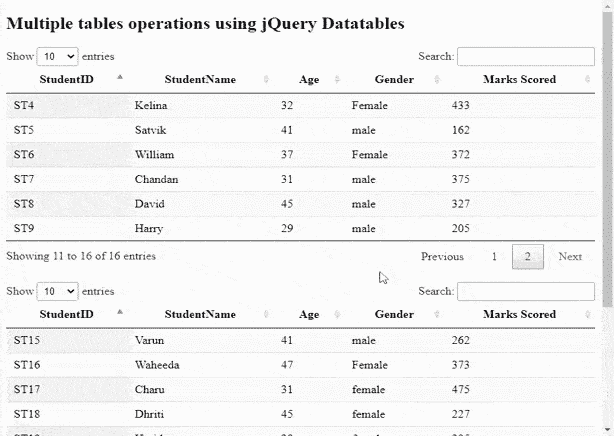
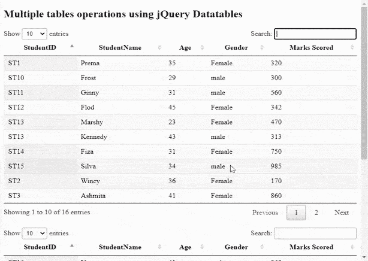

# 如何使用 jQuery DataTables 插件初始化多个表？

> 原文:[https://www . geesforgeks . org/如何使用-jquery-datatables-plugin/](https://www.geeksforgeeks.org/how-to-initialize-multiple-tables-using-jquery-datatables-plugin/) 初始化多个表

**DataTables** 是一个现代 jQuery 插件，用于为我们的网页的 HTML 表格添加交互和高级控件。这是一个非常简单易用的插件，可以根据应用程序的需要为开发人员的自定义更改提供各种选项。该插件的功能包括分页、排序、搜索和多列排序。

在本文中，我们将学习使用 jQuery **数据表**插件初始化多个 HTML 表

需要实现的预编译文件有

CSS:

```html
https://cdn.datatables.net/1.10.22/css/jquery.dataTables.min.css
```

**JavaScript:**

```html
https: //cdn.datatables.net/1.10.22/js/jquery.dataTables.min.js
```

**示例:**使用 **table.display** 选择器用一行代码处理多个表的初始化。这两个表可以一起操作，但它们是独立执行的。

```html
<!DOCTYPE html>
<html>

<head>

    <meta content="initial-scale=1, 
        maximum-scale=1, user-scalable=0"
        name="viewport" />

    <meta name="viewport" 
        content="width=device-width" />

    <!--Datatable plugin CSS file -->
    <link rel="stylesheet" href=
"https://cdn.datatables.net/1.10.22/css/jquery.dataTables.min.css" />

    <!--jQuery library file -->
    <script type="text/javascript" 
        src="https://code.jquery.com/jquery-3.5.1.js">
    </script>

    <!--Datatable plugin JS library file -->
    <script type="text/javascript" 
src="https://cdn.datatables.net/1.10.22/js/jquery.dataTables.min.js">
    </script>
</head>

<body>
    <h2>
        Multiple tables operations
        using jQuery Datatables
    </h2>

    <!--HTML tables with student data-->
    <table id="" class="display" style="width:100%">
        <thead>
            <tr>
                <th>StudentID</th>
                <th>StudentName</th>
                <th>Age</th>
                <th>Gender</th>
                <th>Marks Scored</th>
            </tr>
        </thead>

        <tbody>
            <tr>
                <td>ST1</td>
                <td>Prema</td>
                <td>35</td>
                <td>Female</td>
                <td>320</td>
            </tr>
            <tr>
                <td>ST2</td>
                <td>Wincy</td>
                <td>36</td>
                <td>Female</td>
                <td>170</td>
            </tr>
            <tr>
                <td>ST3</td>
                <td>Ashmita</td>
                <td>41</td>
                <td>Female</td>
                <td>860</td>
            </tr>
            <tr>
                <td>ST4</td>
                <td>Kelina</td>
                <td>32</td>
                <td>Female</td>
                <td>433</td>
            </tr>
            <tr>
                <td>ST5</td>
                <td>Satvik</td>
                <td>41</td>
                <td>male</td>
                <td>162</td>
            </tr>
            <tr>
                <td>ST6</td>
                <td>William</td>
                <td>37</td>
                <td>Female</td>
                <td>372</td>
            </tr>
            <tr>
                <td>ST7</td>
                <td>Chandan</td>
                <td>31</td>
                <td>male</td>
                <td>375</td>
            </tr>
            <tr>
                <td>ST8</td>
                <td>David</td>
                <td>45</td>
                <td>male</td>
                <td>327</td>
            </tr>
            <tr>
                <td>ST9</td>
                <td>Harry</td>
                <td>29</td>
                <td>male</td>
                <td>205</td>
            </tr>
            <tr>
                <td>ST10</td>
                <td>Frost</td>
                <td>29</td>
                <td>male</td>
                <td>300</td>
            </tr>
            <tr>
                <td>ST11</td>
                <td>Ginny</td>
                <td>31</td>
                <td>male</td>
                <td>560</td>
            </tr>
            <tr>
                <td>ST12</td>
                <td>Flod</td>
                <td>45</td>
                <td>Female</td>
                <td>342</td>
            </tr>
            <tr>
                <td>ST13</td>
                <td>Marshy</td>
                <td>23</td>
                <td>Female</td>
                <td>470</td>
            </tr>
            <tr>
                <td>ST13</td>
                <td>Kennedy</td>
                <td>43</td>
                <td>male</td>
                <td>313</td>
            </tr>
            <tr>
                <td>ST14</td>
                <td>Fiza</td>
                <td>31</td>
                <td>Female</td>
                <td>750</td>
            </tr>
            <tr>
                <td>ST15</td>
                <td>Silva</td>
                <td>34</td>
                <td>male</td>
                <td>985</td>
            </tr>
        </tbody>
    </table>
    <br />

    <table id="" class="display" style="width:100%">
        <thead>
            <tr>
                <th>StudentID</th>
                <th>StudentName</th>
                <th>Age</th>
                <th>Gender</th>
                <th>Marks Scored</th>
            </tr>
        </thead>
        <tbody>
            <tr>
                <td>ST15</td>
                <td>Varun</td>
                <td>41</td>
                <td>male</td>
                <td>262</td>
            </tr>
            <tr>
                <td>ST16</td>
                <td>Waheeda</td>
                <td>47</td>
                <td>Female</td>
                <td>373</td>
            </tr>
            <tr>
                <td>ST17</td>
                <td>Charu</td>
                <td>31</td>
                <td>female</td>
                <td>475</td>
            </tr>
            <tr>
                <td>ST18</td>
                <td>Dhriti</td>
                <td>45</td>
                <td>female</td>
                <td>227</td>
            </tr>
            <tr>
                <td>ST19</td>
                <td>Haritha</td>
                <td>39</td>
                <td>female</td>
                <td>295</td>
            </tr>
            <tr>
                <td>ST20</td>
                <td>Faran</td>
                <td>39</td>
                <td>male</td>
                <td>340</td>
            </tr>
            <tr>
                <td>ST21</td>
                <td>Gaurav</td>
                <td>31</td>
                <td>male</td>
                <td>562</td>
            </tr>
            <tr>
                <td>ST22</td>
                <td>Fenny</td>
                <td>41</td>
                <td>Female</td>
                <td>349</td>
            </tr>
            <tr>
                <td>ST23</td>
                <td>Mamta</td>
                <td>29</td>
                <td>Female</td>
                <td>471</td>
            </tr>
            <tr>
                <td>ST23</td>
                <td>Kamat</td>
                <td>44</td>
                <td>male</td>
                <td>319</td>
            </tr>
        </tbody>
    </table>

    <script>
        /* Initialization of datatables */
        $(document).ready(function () {
            $('table.display').DataTable();
        });
    </script>
</body>

</html>
```

**输出:**

以下输出显示两个表的数据都是在初始化后加载的。



下面的输出显示了这两个表是独立执行的，显示了对“女”学生的“搜索”操作。

