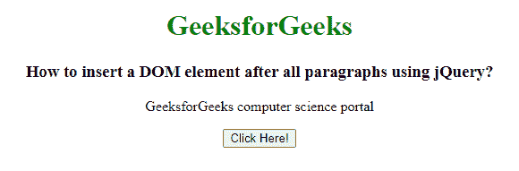

# 如何使用 jQuery 在所有段落后插入一个 DOM 元素？

> 原文:[https://www . geeksforgeeks . org/如何使用-jquery/](https://www.geeksforgeeks.org/how-to-insert-a-dom-element-after-all-paragraphs-using-jquery/) 在所有段落后插入 dom 元素

在本文中，我们将使用 jQuery 在所有段落元素之后插入一个 DOM 元素。要在()和 createTextNode()方法之后插入一个 DOM 元素。 **createTextNode()** 方法用于创建一个包含一个元素节点和一个文本节点的文本节点。它用于向元素提供文本。()后的**方法用于在每个选定的元素后插入指定的内容。**

****语法:****

```html
$( selector ).after( content );
```

****示例:****

## **超文本标记语言**

```html
<!DOCTYPE html>
<html>

<head>
    <!-- Import jQuery from CDN library -->
    <script src=
"https://ajax.googleapis.com/ajax/libs/jquery/3.3.1/jquery.min.js">
    </script>

    <script>
        $(document).ready(function () {
            $("button").click(function () {
                $("p").after(document
                    .createTextNode("Hello World!"));
            });
        });
    </script>
</head>

<body style="text-align: center;">
    <h1 style="color: green;">
        GeeksforGeeks
    </h1>
    <h3>
        How to insert a DOM element after
        all paragraphs using jQuery?
    </h3>

    <p>
        GeeksforGeeks computer
        science portal
    </p>

    <button>Click Here!</button>
</body>

</html>
```

****输出:****

****点击按钮前:****

****

****点击按钮后:****

****