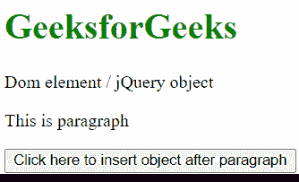

# 如何使用 jQuery 在所有段落后插入一个 jQuery 对象？

> 原文:[https://www . geeksforgeeks . org/how-insert-a-jquery-object-after-after-段落-using-jquery/](https://www.geeksforgeeks.org/how-to-insert-a-jquery-object-after-all-paragraphs-using-jquery/)

任务是使用 jQuery 在所有段落之后插入一个 jQuery 对象。

**进场:**

*   使用标签创建 DOM 元素或 jQuery 对象。
*   使用

    标签创建段落。

*   点击后使用按钮标签创建一个按钮，对象将被插入到段落之后。
*   写一个脚本，调用一个函数 [jQuery.after()](https://www.geeksforgeeks.org/jquery-after-with-examples/) ，用来在所有段落后插入一个 jQuery 对象。

**示例:**下面是使用上述步骤的工作代码。

## 超文本标记语言

```
<!DOCTYPE HTML>
<html>

<head>
  <script src=
"https://code.jquery.com/jquery-git.js">
  </script>
</head>

<body>
  <h1 style="color:green"> 
     GeeksforGeeks 
  </h1>

  <span>
     Dom element / jQuery object
  </span>

<p>
     This is paragraph
  </p>

  <button id="GFG_button1" style="display: block;
     margin-top: 15px;">
     Click here to insert object after paragraph
  </button>

  <script>
      $('#GFG_button1').click(function () {
          $("p").after($("span"));
      });
  </script>
</body>

</html>
```

**输出:**

