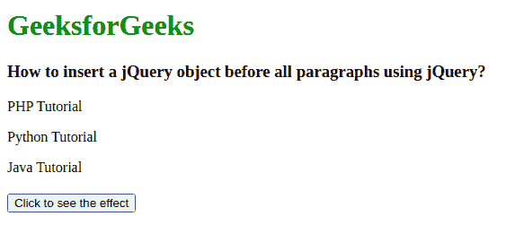
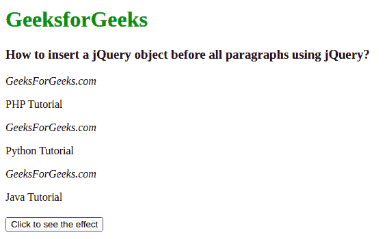

# 如何使用 jQuery 在所有段落前插入一个对象？

> 原文:[https://www . geeksforgeeks . org/如何使用-jquery/](https://www.geeksforgeeks.org/how-to-insert-an-object-before-all-paragraphs-using-jquery/) 在所有段落前插入对象

jQuery 是一个 Javascript 库，用来减轻 web 开发人员的任务。开发人员可以使用 Jquery 库，而不是在代码中使用 Javascript。Jquery 提供了很多好的特性，比如 DOM 操作、事件处理、AJAX 支持等。

强烈建议在学习 Jquery 之前先学习 HTML、CSS 和 Javascript 的基础知识。

**方法:**可以使用调用的方法在所有段落前插入一个 jQuery 对象。 ***前()*** 。

*   **[before()](https://www.geeksforgeeks.org/jquery-before-method/) :** 此方法用于在匹配元素集中的每个元素之前插入参数指定的内容。它可以接受任何数量的附加参数，如–。prepend()和。在()之后。

*   **[isner before()](https://www.geeksforgeeks.org/jquery-insertbefore-with-examples/):**它与上面的函数类似，但是内容在方法之前，并且插入到目标之前，而目标又作为。insertBefore()方法的参数。

**语法:**

```
$(target).before(contentToBeInserted).
$(contentToBeInserted).insertBefore(target).
```

**示例:**

## 超文本标记语言

```
<!DOCTYPE html>
<html>
    <head>
        <script src=
"https://code.jquery.com/jquery-git.js">
        </script>
        <meta charset="utf-8" />
        <meta name="viewport" 
              content="width=device-width" />
        <style type="text/css">
            button {
                display: block;
                margin: 20px 0 0 0;
            }
        </style>
    </head>
    <body>
      <h1 style="color: green;">
        GeeksforGeeks
    </h1>

    <h3>
        How to insert a jQuery object before
        all paragraphs using jQuery?
    </h3>
        <p>PHP Tutorial</p>
        <p>Python Tutorial</p>
        <p>Java Tutorial</p>
        <button id="button1">
          Click to see the effect
        </button>
        <script>
            $("#button1").click(function () {
                $("p").before("<i>GeeksForGeeks.com</i>");
            });
        </script>
    </body>
</html>
```

**输出:**

*   **在点击之前:**在 body 元素中，我们最初有 3 个不同的段落命名——PHP 教程、Python 教程和 Java 教程。

    

*   **点击后:**点击按钮后，现在可以注意到每一段前都插入了 GeeksForGeeks.com。

    