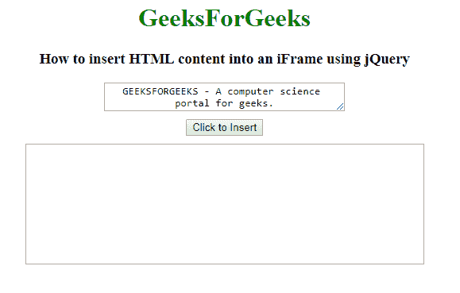
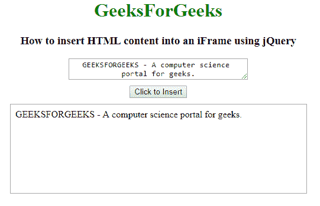
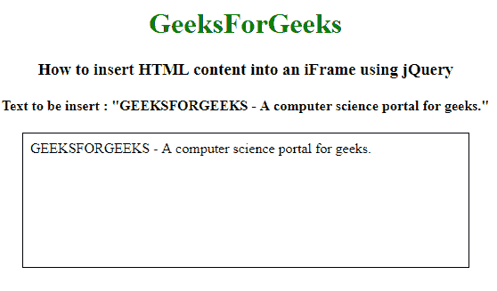

# 如何使用 jQuery 将 HTML 内容插入到 iFrame 中？

> 原文:[https://www . geesforgeks . org/how-insert-html-content-in-iframe-using-jquery/](https://www.geeksforgeeks.org/how-to-insert-html-content-into-an-iframe-using-jquery/)

下面是使用 jQuery 将 HTML 内容插入 iFrame 的任务。为此，我们可以使用 jQuery **contents()方法**。

**The。contents()方法:**它返回所有的直接子元素，包括所选元素的文本和注释节点。

**语法:**

```html
$(selector).contents()
```

**Approach:**

*   在正文部分找到 iframe。*   获取要插入到正文部分的 iframe 中的值*   Place the value in the iframe

    **jQuery 代码展示这种方法的工作原理:**
    **示例 1:**

    ```html
    <!DOCTYPE html>
    <html>

    <head>
        <title>How to insert HTML content 
          into an iFrame using jQuery?</title>
        <script src="https://code.jquery.com/jquery-1.12.4.min.js">
      </script>
        <style type="text/css">
            textarea,
            iframe {
                display: block;
                margin: 10px 0;
            }

            iframe {
                width: 500px;
                border: 1px solid #000000;
            }
        </style>
    </head>

    <body>
        <center>
            <h1 style="color:green;"> 
            GeeksForGeeks 
        </h1>
            <h3>
              How to insert HTML content into an iFrame using jQuery
          </h3>
            <textarea rows="2" cols="40" style="text-align:center;">
              GEEKSFORGEEKS - A computer science portal for geeks.
          </textarea>
            <button type="button" onclick="updateIframe()">
              Click to Insert
          </button>
            <iframe style="text-align:center;" id="myframe"></iframe>
            <script type="text/javascript">
                function updateIframe() {
                    var myFrame = $("#myframe").contents().find('body');
                    var textareaValue = $("textarea").val();
                    myFrame.html(textareaValue);
                }
            </script>
        </center>
    </body>

    </html>
    ```

    **输出:**
    **点击按钮前:**
    
    **点击按钮后:**
    

    **例 2:**

    ```html
    <!DOCTYPE html>
    <html>

    <head>
        <title>How to insert HTML content
          into an iFrame using jQuery?</title>
        <script src="https://code.jquery.com/jquery-1.12.4.min.js">
      </script>
        <style type="text/css">
            iframe {
                width: 500px;
                border: 1px solid #000000;
            }
        </style>
    </head>

    <body>
        <center>
            <h1 style="color:green;"> 
            GeeksForGeeks 
        </h1>
            <h3>How to insert HTML content 
              into an iFrame using jQuery</h3>

            <h4>Text to be insert : "GEEKSFORGEEKS 
              - A computer science portal for geeks."</h4>
            <iframe style="text-align:center;" id="iframe">
          </iframe>
            <script>
                $("#iframe").ready(function() {
                    var body = $("#iframe").contents().find("body");
                    body.append(
                      'GEEKSFORGEEKS - A computer science portal for geeks.');
                });
            </script>
        </center>
    </body>

    </html>
    ```

    **输出:**
    