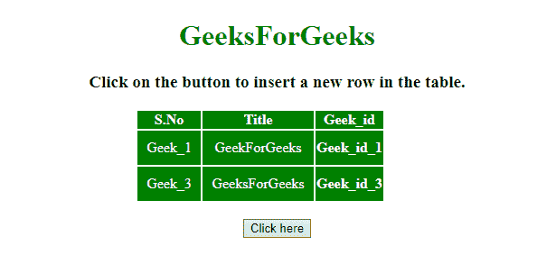
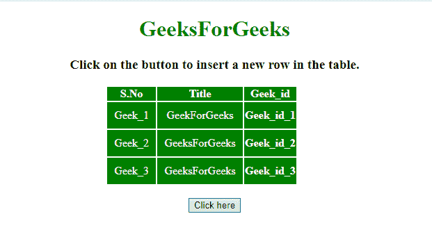

# jQuery 中如何在表的某个索引处插入新行？

> 原文:[https://www . geeksforgeeks . org/如何在 jquery 表中的某个索引处插入新行/](https://www.geeksforgeeks.org/how-to-insert-new-row-at-a-certain-index-in-a-table-in-jquery/)

给定一个包含表格的 HTML 文档。任务是使用 JQuery 在该表的某个索引处插入一个新行。

**进场:**

*   将表列值柠檬存储到变量中。
*   然后使用 **eq()和之后的()方法**在表格中插入该行。

**示例 1:** 在此示例中，行插入到索引 1 处(硬编码)。

```
<!DOCTYPE HTML> 
<html> 
    <head> 
        <title> 
            Insert new row at a certain index
            in a table using jQuery
        </title> 

        <script src = 
"https://ajax.googleapis.com/ajax/libs/jquery/3.4.0/jquery.min.js">
        </script>

        <style>
            #myCol {
                background:green;
            }
            table {
                color:white;
            }
            #Geek_p {
                color:green;
                font-size:30px;
            }
            td {
                padding:10px;
            }
        </style>
    </head>

    <body> 
        <center>    
        <h1 style = "color:green;" > 
            GeeksForGeeks 
        </h1> 

        <strong>
            Click on the button to insert
            a new row in the table
        </strong>

        <br><br>

        <table>
            <colgroup>
                <col id="myCol"
                    span="2">
                <col style="background-color:green">
            </colgroup>

            <tr>
                <th>S.No</th>
                <th>Title</th>
                <th>Geek_id</th>
            </tr>
            <tr id = "row1">
                <td>Geek_1</td>
                <td>GeekForGeeks</td>
                <th>Geek_id_1</th>
            </tr>
            <tr>
                <td>Geek_3</td>
                <td>GeeksForGeeks</td>
                <th>Geek_id_3</th>
            </tr>
        </table>
        <br>

        <button onclick = "Geeks()"> 
            Click here
        </button> 

        <!-- Script to insert new row in a table -->
        <script> 
            function Geeks() {
                var html = 
                "<td>Geek_2</td><td>GeeksForGeeks</td><th>Geek_id_2</th>";

                $('table > tbody > tr').eq(1).after(html);
            }
        </script> 
        </center>
    </body> 
</html>                    
```

**输出:**

*   **点击按钮前:**
    
*   **点击按钮后:**
    

**示例 2:** 在该示例中，该行被插入到用户提供的索引处。

```
<!DOCTYPE HTML> 
<html> 
    <head> 
        <title> 
            Insert new row at a certain index
            in a table using jQuery
        </title> 

        <script src = 
"https://ajax.googleapis.com/ajax/libs/jquery/3.4.0/jquery.min.js">
        </script>

        <style>
            #myCol {
                background:green;
            }
            table {
                color:white;
            }
            #Geek_p {
                color:green;
                font-size:30px;
            }
            td {
                padding:10px;
            }
        </style>
    </head>

    <body> 
        <center>    
        <h1 style = "color:green;" > 
            GeeksForGeeks 
        </h1> 

        <strong>
            Click on the button to insert
            a new row in the table
        </strong>

        <br><br>

        <table>
            <colgroup>
                <col id="myCol"
                    span="2">
                <col style="background-color:green">
            </colgroup>

            <tr>
                <th>S.No</th>
                <th>Title</th>
                <th>Geek_id</th>
            </tr>
            <tr id = "row1">
                <td>Geek_1</td>
                <td>GeekForGeeks</td>
                <th>Geek_id_1</th>
            </tr>
            <tr>
                <td>Geek_3</td>
                <td>GeeksForGeeks</td>
                <th>Geek_id_3</th>
            </tr>
        </table>
        <br>

        <button onclick = "Geeks()"> 
            Click here
        </button> 

        <!-- Script to insert new row in a table -->
        <script> 
            function Geeks() {
                var i = 2;
                var html = 
                "<td>Geek_2</td><td>GeeksForGeeks</td><th>Geek_id_2</th>";

                $('table > tbody > tr').eq(i - 1).after(html);
            }
        </script> 
        </center>
    </body> 
</html>                    
```

**输出:**

*   **点击按钮前:**
    
*   **点击按钮后:**
    