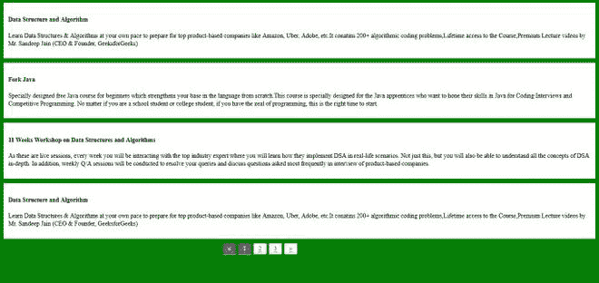

# 如何集成 jQuery 分页插件？

> 原文:[https://www . geesforgeks . org/如何集成-jquery-分页-插件/](https://www.geeksforgeeks.org/how-to-integrate-jquery-pagination-plugin/)

**simple paging . js**是一个 **jQuery** 插件，在我们的网站中提供简单但完全可定制的分页。这是一个健壮的和高度可定制的基于 jQuery 的分页系统，用于您的长内容，以提高网页可读性。其主要特点如下。

*   您可以对网页上的任何一组 HTML 元素进行分页。
*   它易于使用，可用于动态生成分页链接。
*   它是高度可定制的。

现在让我们知道如何在我们的网站上集成这个分页插件。

首先在你的 html 文件中包含这些 **CDN** 链接。

> <src 脚本= " https://cdnjs . cloudflare . com/Ajax/libs/simple paging . js/1.6/jquery . simple paging . min . js "></script><rel = " style sheet "链接 href= "中

**示例:**

## 超文本标记语言

```
<!DOCTYPE html>
<>

<head>
    <script src="https://ajax.googleapis.com/ajax/libs/jquery/3.3.1/jquery.min.js"></script>
    <script src="https://cdnjs.cloudflare.com/ajax/libs/simplePagination.js/1.6/jquery.simplePagination.min.js"></script>
    <link rel="stylesheet" href="https://cdnjs.cloudflare.com/ajax/libs/simplePagination.js/1.6/simplePagination.min.css">
    <style type="text/css">
        body {
            font-size: 14px;
            line-height: 18px;
            background: green;
        }

        .item {
            border: 1px solid #EEE;
            background: #FFF;
            margin-bottom: 10px;
            padding: 10px;
        }

        #pagination {
            margin-left: 500px;
        }
    </style>
</head>

<body>
    <div class="wrapper">
        <div class="item">
            <h4>Data Structure and Algorithm</h4>
            <p>
                Learn Data Structures & Algorithms 
                at your own pace to prepare for top 
                product-based companies like Amazon, 
                Uber, Adobe, etc. It contains 200+ 
                algorithmic coding problems, Lifetime 
                access to the Course, Premium Lecture 
                videos by Mr. Sandeep Jain
                (CEO & Founder, GeeksforGeeks)
            </p>
        </div>

        <div class="item">
            <h4>Fork Java</h4>
            <p>Specially designed free Java course 
                for beginners which strengthens 
                your base in the language from 
                scratch. This course is specially 
                designed for the Java apprentices 
                who want to hone their skills 
                in Java for Coding Interviews 
                and Competitive
                Programming. No matter if you 
                are a school student or college 
                student, if you have the zeal of 
                programming, this is the right 
                time to start. 
            </p>
        </div>

        <div class="item">
            <h4>
                11 Weeks Workshop on Data 
                Structures and Algorithms 
            </h4>

            <p>
                As these are live sessions, every 
                week you will be interacting with 
                the top industry expert where you
                will learn how they implement DSA 
                in real-life scenarios. Not just 
                this, but you will also be able to 
                understand all the concepts of DSA
                in-depth. In addition, weekly Q/A 
                sessions will be conducted to 
                resolve your queries and discuss 
                questions asked most frequently in 
                interview of product-based companies.
            </p>
        </div>

        <div class="item">
            <h4>Data Structure and Algorithm</h4>
            <p>
                Learn Data Structures & Algorithms 
                at your own pace to prepare for top 
                product-based companies like Amazon, 
                Uber, Adobe, etc. It contains 200+ 
                algorithmic coding problems, Lifetime 
                access to the Course, Premium Lecture 
                videos by Mr. Sandeep Jain (CEO & 
                Founder, GeeksforGeeks)
            </p>
        </div>

        <div class="item">
            <h4>Fork Java</h4>     
            <p>
                Specially designed free Java course for 
                beginners which strengthens your base in 
                the language from scratch. This course is 
                specially designed for the Java apprentices 
                who want to hone their skills in Java 
                for Coding Interviews and Competitive
                Programming. No matter if you are a 
                school student or college student, 
                if you have the zeal of programming, 
                this is the right time to start. 
            </p>
        </div>

        <div class="item">
            <h4>
                11 Weeks Workshop on Data 
                Structures and Algorithms 
            </h4> 
            <p>
                As these are live sessions, every 
                week you will be interacting with 
                the top industry expert where you 
                will learn how they implement DSA 
                in real-life scenarios. Not just 
                this, but you will also be able to 
                understand all the concepts of DSA
                in-depth. In addition, weekly Q/A 
                sessions will be conducted to resolve 
                your queries and discuss questions 
                asked most frequently in interview 
                of product-based companies.
            </p>
        </div>

        <div class="item">
            <h4>Data Structure and Algorithm</h4>     
            <p>
                Learn Data Structures & Algorithms 
                at your own pace to prepare for top 
                product-based companies like Amazon, 
                Uber, Adobe, etc. It contains 200+ 
                algorithmic coding problems, Lifetime 
                access to the Course, Premium Lecture 
                videos by Mr. Sandeep Jain
                (CEO & Founder, GeeksforGeeks)
            </p>
        </div>

        <div class="item">
            <h4>Fork Java</h4>     
            <p>
                Specially designed free Java course 
                for beginners which strengthens your 
                base in the language from scratch.
                This course is specially designed for
                the Java apprentices who want to hone 
                their skills in Java for Coding 
                Interviews and Competitive Programming. 
                No matter if you are a school student 
                or college student, if you have the 
                zeal of programming, this is the 
                right time to start. 
            </p>
        </div>

        <div class="item">
            <h4>
                11 Weeks Workshop on Data 
                Structures and Algorithms 
            </h4> 
            <p>
                As these are live sessions,
                every week you will be interacting 
                with the top industry expert where 
                you will learn how they implement DSA 
                in real-life scenarios. Not just this, 
                but you will also be able to understand 
                all the concepts of DSA
                in-depth. In addition, weekly Q/A 
                sessions will be conducted to resolve 
                your queries and discuss questions asked 
                most frequently in interview of 
                product-based companies.
            </p>
        </div>
    </div>

    <div id="pagination"></div>

    <script>
        $(".wrapper .item").slice(4).hide();
        $('#pagination').pagination({

            // Total number of items present
            // in wrapper class
            items: 9,

            // Items allowed on a single page
            itemsOnPage: 4, 
            onPageClick: function (noofele) {
                $(".wrapper .item").hide()
                    .slice(4*(noofele-1),
                    4+ 4* (noofele - 1)).show();
            }
        });
    </script>
</body>

</html>
```

**输出:**



底部分页