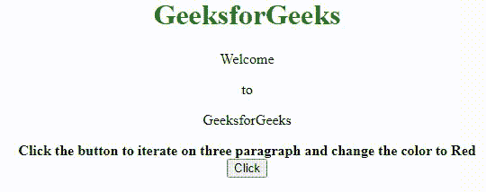

# 如何在 jQuery 中迭代三个段落并将其颜色属性设置为红色？

> 原文:[https://www . geeksforgeeks . org/如何迭代三段并设置它们的颜色属性-红色-in-jquery/](https://www.geeksforgeeks.org/how-to-iterate-over-three-paragraphs-and-sets-their-color-property-red-in-jquery/)

在本文中，我们将学习如何迭代三个段落，并在 jQuery 中将它们的颜色属性设置为红色。我们有三个段落，我们希望在这些段落上进行迭代，并将它们的颜色属性设置为红色。

**方法:**首先，我们添加一个按钮，点击这个按钮，调用一个名为 fun()的函数，在这个函数中，我们选择 p 元素，使用 JQuery 中的 **[每个()函数](https://www.geeksforgeeks.org/jquery-misc-each-method/)** 迭代每个段落，并使用 Jquery 中的 **[css()方法](https://www.geeksforgeeks.org/jquery-css-method/)** 将其颜色改为红色。

```
function fun(){
    $("p").each(function(){
        $(this).css("color","red");
    });
}
```

**示例:**

## 超文本标记语言

```
<!DOCTYPE html>
<html lang="en">
  <head>
    <style>
      h1 {
        color: green;
      }
    </style>
    <script src=
"https://code.jquery.com/jquery-3.5.0.js">
    </script>
  </head>
  <body>
    <center>
      <h1>GeeksforGeeks</h1>
      <p>Welcome</p>
      <p>to</p>
      <p>GeeksforGeeks</p>
      <strong>
        Click the button to iterate on three
        paragraph and change the color to
        Red
      </strong>
      <br />
      <button onclick="fun()">Click</button>
    </center>

    <script>
      function fun() {
        $("p").each(function () {
          $(this).css("color", "red");
        });
      }
    </script>
  </body>
</html>
```

**输出:**

