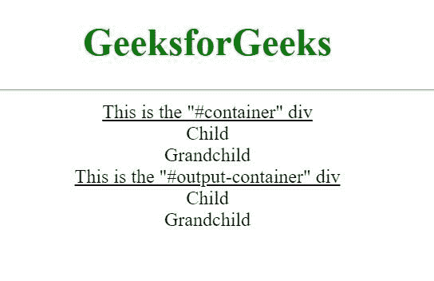
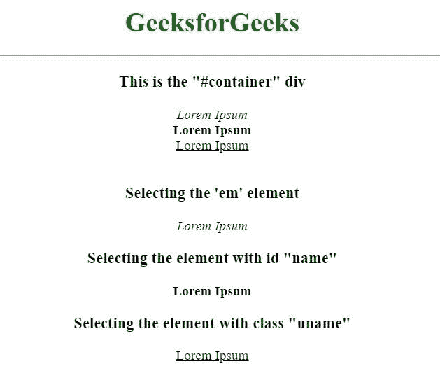

# 如何使用 jQuery 迭代 div 的子元素？

> 原文:[https://www . geeksforgeeks . org/如何使用-jquery/](https://www.geeksforgeeks.org/how-to-iterate-through-child-elements-of-a-div-using-jquery/)

jQuery [选择器](https://www.geeksforgeeks.org/jquery-selectors-and-event-methods/)可以用来从 DOM 中查找(选择)HTML 元素。一旦选择了一个元素，就调用 jQuery [children()](https://www.geeksforgeeks.org/jquery-children-with-examples/) 方法来查找所选元素的所有子元素。为了遍历子元素，使用了 jQuery [each()](https://www.geeksforgeeks.org/jquery-misc-each-method/) 方法，如下例所示。

**示例 1:** 示例 HTML 页面包含一个“容器”div，其中包含一些子元素。循环贯穿“容器”div 的所有子元素，然后将它们复制到最初没有子元素的“输出容器”div。

```html
<!DOCTYPE html>
<html>

<head>
    <!-- Including the jQuery 
        library's script -->
    <script src=
"https://code.jquery.com/jquery-3.5.1.min.js">
    </script>
</head>

<body style="text-align: center;">
    <h1 style="color: #008000">
        GeeksforGeeks
    </h1>
    <hr>

    <u>This is the "#container" div</u>

    <div id="container">
        <div>
            Child
            <div>
                Grandchild
            </div>
        </div>
    </div>

    <u>This is the "#output-container" div</u>
    <div id="output-container"></div>

    <script>
        // loop through the child elements
        // of the "#container" div
        $("#container").children()
                .each(function () {

            // "this" is the current child
            // in the loop grabbing this 
            // element in the form of string
            // and appending it to the 
            // "#output-container" div
            var element = $(this)
                    .prop('outerHTML');

            $("#output-container")
                    .append(element);
        });
    </script>
</body>

</html>
```

**输出:**


**示例 2:** 在上面的示例中，通过所有子元素实现循环。但是如果需要循环某些特定的子元素或具有特定类或 id 的元素，那么它将作为参数传递给 **children()** 函数，如下所示。

```html
<!DOCTYPE html>
<html>

<head>
    <!-- Including the jQuery 
        library's script -->
    <script src=
"https://code.jquery.com/jquery-3.5.1.min.js">
    </script>
</head>

<body>
    <h1 style="color: #008000">
        GeeksforGeeks
    </h1>
    <hr>

    <h3>This is the "#container" div</h3>

    <div id="container">
        <em>Lorem Ipsum</em><br>
        <strong id="name">
            Lorem Ipsum
        </strong><br>

        <u class="uname">Lorem Ipsum</u>
    </div>
    <br>

    <h3>Selecting the 'em' element</h3>
    <div id="em-container"></div>

    <h3>
        Selecting the element 
        with id "name"
    </h3>
    <div id="name-container"></div>

    <h3>
        Selecting the element 
        with class "uname"
    </h3>
    <div id="uname-container"></div>

    <script>

        // looping over the child 'em' 
        // elements of the "#container" div
        $("#container").children('em').each(function()
        {
            var element = $(this).prop('outerHTML');
            $("#em-container").append(element);
        });

        // looping over the child elements of
        // the "#container" div having id as "name"
        $("#container").children('#name').each(function()
        {
            var element = $(this).prop('outerHTML');
            $("#name-container").append(element);
        });

        // looping over the child elements of
        // the "#container" div having class as "uname"
        $("#container").children('.uname').each(function()
        {
            var element = $(this).prop('outerHTML');
            $("#uname-container").append(element);
        });
    </script>
</body>

</html>
```

**输出:**


上面的示例演示了所有三种情况，循环遍历特定的子元素，循环遍历具有特定 id 的子元素，以及循环遍历具有特定类的子元素。

jQuery 是一个开源的 JavaScript 库，它简化了 HTML/CSS 文档之间的交互，它以其“少写多做”的理念而闻名。
跟随本 [jQuery 教程](https://www.geeksforgeeks.org/jquery-tutorials/)和 [jQuery 示例](https://www.geeksforgeeks.org/jquery-examples/)可以从头开始学习 jQuery。