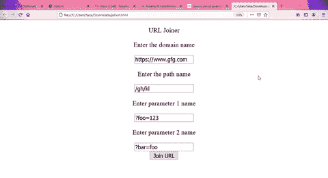

# 如何在 jQuery 中将所有给定的 URL 段连接在一起？

> 原文:[https://www . geeksforgeeks . org/如何在 jquery 中将所有给定的 url 段连接在一起/](https://www.geeksforgeeks.org/how-to-join-all-given-url-segments-together-in-jquery/)

在本文中，我们将看到如何使用 JavaScript 将所有给定的网址段连接在一起。统一地址定位器由几个部分组成，下面列出了这些部分:

*   **方案—** 它定义了用于访问互联网的协议。
*   **域名—** 它定义了保存资源的主机名。
*   **文件路径—** 它定义了您想要访问的主机中的特定资源。
*   **参数—** 用于提供一串要使用的信息。

在 JavaScript 中，我们可以使用正则表达式来识别 URL 的哪一部分是提供给我们的，因此我们可以将所有的段连接在一起。让我们看一个例子，了解如何将所有给定的网址段连接在一起。

**示例:**

## 超文本标记语言

```html
<!DOCTYPE html>
<html lang="en">

<head>
    <meta charset="UTF-8" />
    <meta name="viewport" content=
        "width=device-width, initial-scale=1.0" />

    <script src=
"https://ajax.googleapis.com/ajax/libs/jquery/3.5.1/jquery.min.js">
    </script>
</head>

<body style="text-align:center">
    <p>URL Joiner</p>

    <p>Enter the domain name</p>
    <input type="text" name="domain" id="domain"><br>

    <p>Enter the path name</p>
    <input type="text" name="path" id="path"><br>

    <p>Enter parameter 1 name</p>
    <input type="text" name="parameter1" id="parameter1"><br>

    <p>Enter parameter 2 name</p>
    <input type="text" name="parameter2" id="parameter2"><br>
    <button id="b1" onclick="urljoin()">Join URL</button>
    <div id="display"></div>

    <script>

        // Function to join segments of URL
        function urljoin() {
            var domain = ($("#domain").val());
            var path = ($("#path").val());
            var parameter1 = ($("#parameter1").val());
            var parameter2 = ($("#parameter2").val());

            var res = [domain, path, parameter1, parameter2];

            // Joining each part of domains and appending
            // / after the end of each part
            res.join('/');

            var init = "";
            for (var i = 0; i < res.length; i++) {
                init += res[i];
            }
            var temp1 = init.replace(/[\/]+/g, '/')

            // Regex for mathcing domain 
            var temp2 = temp1.replace(/^(.+):\//, '$1://')
            var temp3 = temp2.replace(/^f:/, 'f:/')
            var temp4 = temp3.replace(/\/(\?|&|#[^!])/g, '$1')

            // Regex for joining different search parameters
            var temp5 = temp4.replace(/\?/g, '&')
            var finalres = temp5.replace('&', '?');

            $("#display").html(
                "Joined URL is as follows:-" + finalres);
        }
    </script>
</body>

</html>
```

**输出:**

