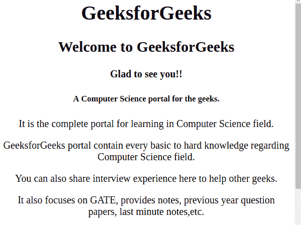
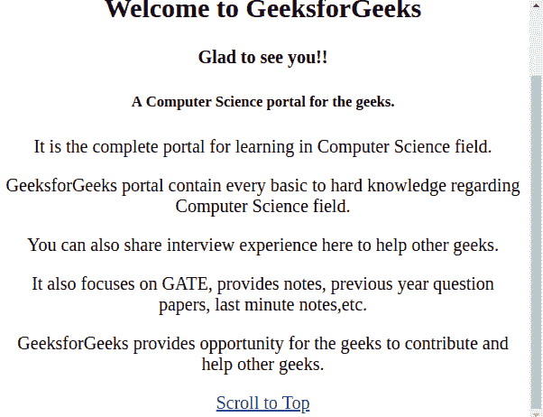

# 如何使用 jQuery 跳转到浏览器页面顶部？

> 原文:[https://www . geeksforgeeks . org/如何使用-jquery/](https://www.geeksforgeeks.org/how-to-jump-to-top-of-browser-page-using-jquery/) 跳转到浏览器页面顶部

当网站在单个页面上包含大量数据时，当向下查看网站时，如果用户想在不滚动的情况下查看主要内容，即浏览器页面的顶部，这可以通过使用 **jQuery** 来实现。

**示例:跳转到浏览器页面顶部**

```html
<html>
<head>
<script src=
"http://ajax.googleapis.com/ajax/libs/jquery/1.4.3/jquery.min.js">
</script>
     <script>
         $(function () 
         {
             $('#Top').click(function () 
             {
                 $('html, body').animate(
                     {
                     scrollTop: '0px'
                 },
                 1500);
                 return false;
             });
         });
    </script>
</head>
<body>
    <center>
        <h1>GeeksforGeeks</h1>
        <h2>Welcome to GeeksforGeeks</h2>
        <h4>Glad to see you!!</h4>
        <h5>A Computer Science portal for the geeks.</h5>
        <p>It is the complete portal for learning in Computer Science field.</p>
        <p>GeeksforGeeks portal contain every basic to hard knowledge regarding
        Computer Science field.</p>
        <p>You can also share interview experience here to help other geeks.</p>
        <p>It also focuses on GATE, provides notes, previous year question papers,
        last minute notes, etc.</p>
        <p>GeeksforGeeks provides opportunity for the geeks to contribute
        and help other geeks.</p>
        <a id="scrlTop" href="#">Scroll to Top</a>
    </center>
</body>
</html>
```

**输出:**

**点击*前【滚动至顶部】***



**在点击*【滚动到顶部】***


后，在上例中，当我们点击 ***【滚动到顶部】*** 链接时，它会自动跳转到浏览器页面的顶部。