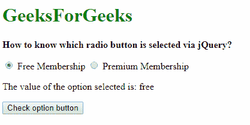
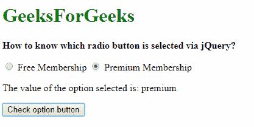

# 如何使用 jQuery 知道选择了哪个单选按钮？

> 原文:[https://www . geesforgeks . org/how-to-know-what-radio-button-selected-use-jquery/](https://www.geeksforgeeks.org/how-to-know-which-radio-button-is-selected-using-jquery/)

要检查表单中选择了哪个单选按钮，我们首先获取所需的输入组，输入类型为选项，然后通过 [**val()** 方法](https://www.geeksforgeeks.org/jquery-val-with-examples/)可以访问该选项的值。这将返回当前选定选项的名称。

选择器**'输入[名称=选项]:选中'**用于选择所有以指定形式输入选项类型的输入组。

**语法:**

```html
$('input[name=option]:checked', 'formName').val()
```

这在下面的示例中显示。
**例:**

```html
<!DOCTYPE html>
<html>
<head>
    <title>
      How to know which radio button
      is selected via jQuery?
  </title>
</head>

<body>
    <h1 style="color: green">
      GeeksForGeeks
  </h1>
    <b>
      How to know which radio 
      button is selected via jQuery?
  </b>
    <p>
        <form id="myForm">
            <label>
                <input 
                       type="radio"
                       name="option" 
                       value="free">
              Free Membership
            </label>
            <label>
                <input type="radio" 
                       name="option" 
                       value="premium">
              Premium Membership
            </label>
        </form>

    <p>
      The value of the option selected is: 
      <span class="output"></span>
  </p>
    <button id="btn">
      Check option button
  </button>

    <script src=
"https://code.jquery.com/jquery-2.2.4.min.js">
  </script>

    <script type="text/javascript">

      // Check the radio button value.
        $('#btn').on('click', function() {
            output = 
              $('input[name=option]:checked',
                '#myForm').val();

            document.querySelector(
              '.output').textContent = output;
        });
    </script>
</body>

</html>
```

**输出:**

**勾选后点击第一个选项:**


**勾选后点击第二个选项:**


jQuery 是一个开源的 JavaScript 库，它简化了 HTML/CSS 文档之间的交互，它以其“少写多做”的理念而闻名。
跟随本 [jQuery 教程](https://www.geeksforgeeks.org/jquery-tutorials/)和 [jQuery 示例](https://www.geeksforgeeks.org/jquery-examples/)可以从头开始学习 jQuery。