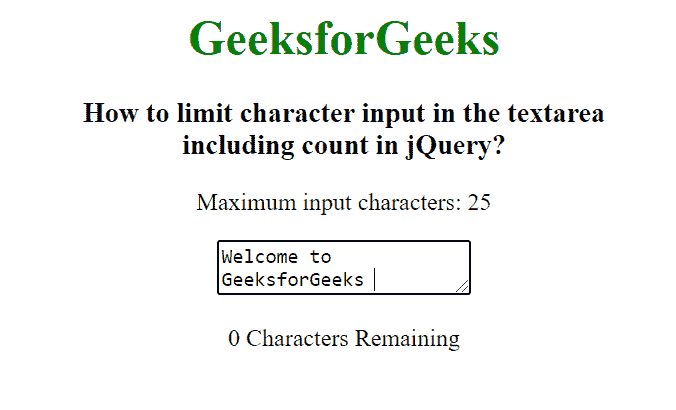

# 如何限制 jQuery 中包含计数的 textarea 中的字符输入？

> 原文:[https://www . geeksforgeeks . org/如何限制字符输入-in-textarea-include-count-in-jquery/](https://www.geeksforgeeks.org/how-to-limit-character-input-in-textarea-including-count-in-jquery/)

在本文中，我们将在 jQuery 中设置 textarea 中的字符输入限制，包括计数。要在输入文本区设置限制字符，我们使用 length 属性。

**进场:**

我们创建一个给定最大长度的输入文本区域，然后使用 jQuery 代码来限制字符。首先，我们设置最大限制，然后当我们点击按钮并在屏幕上显示计数时，使用**()**方法将文本区域字符限制减少 1。

**语法:**

```html
var max_length = 25;
$('textarea').keyup(function () {
    var len = max_length - $(this).val().length;
    $('.GFG').text(len);
});
```

**示例:**

## 超文本标记语言

```html
<!DOCTYPE html>
<html lang="en">

<head>
    <title>
        How to limit character input
        in the textarea including
        count in jQuery?
    </title>

    <!-- Import jQuery cdn library -->
    <script src=
"https://ajax.googleapis.com/ajax/libs/jquery/3.3.1/jquery.min.js">
    </script>

    <script>
        $(document).ready(function () {
            var max_length = 25;
            $('textarea').keyup(function () {
                var len = max_length - $(this).val().length;
                $('.GFG').text(len);
            });

        });
    </script>
</head>

<body style="text-align: center;">
    <h1 style="color: green;">
        GeeksforGeeks
    </h1>

    <h3>
        How to limit character input
        in the textarea <br>including
        count in jQuery?
    </h3>

    <form>

<p>Maximum input characters: 25</p>

        <textarea maxlength="25"></textarea>

<p>
            <span class="GFG">25</span> 
            Characters Remaining
        </p>

    </form>
</body>

</html>
```

**输出:**

